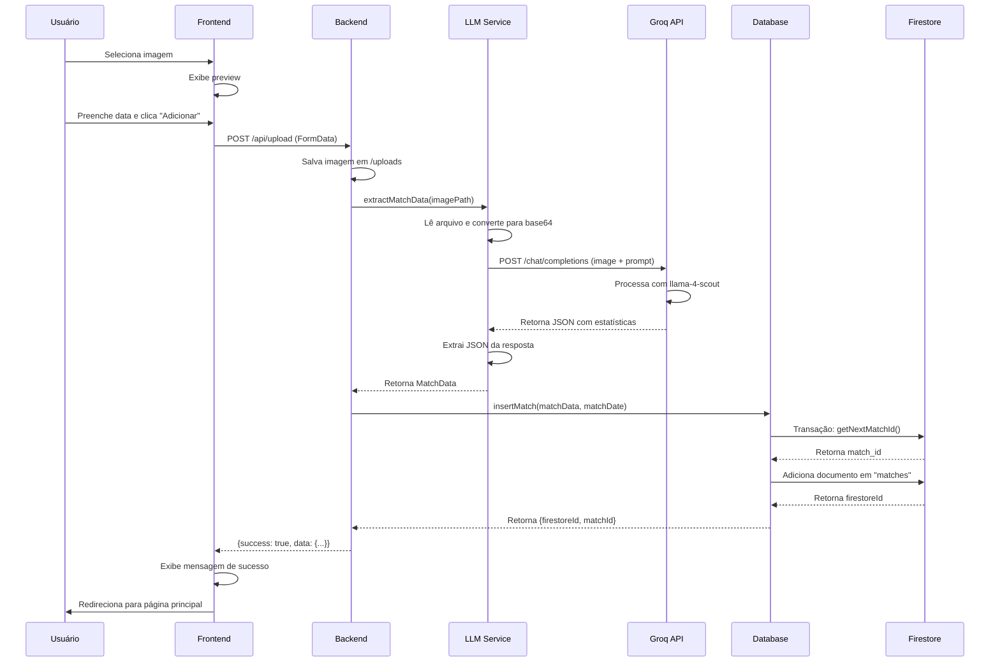
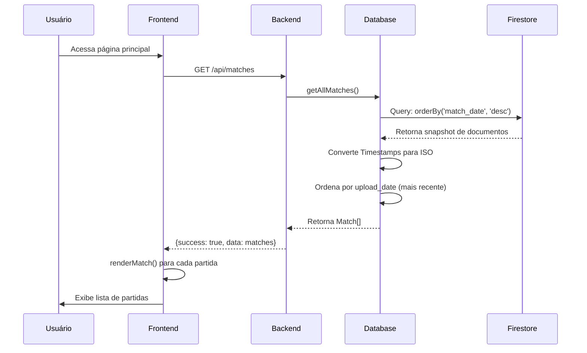
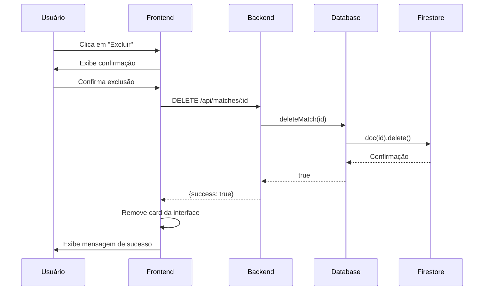
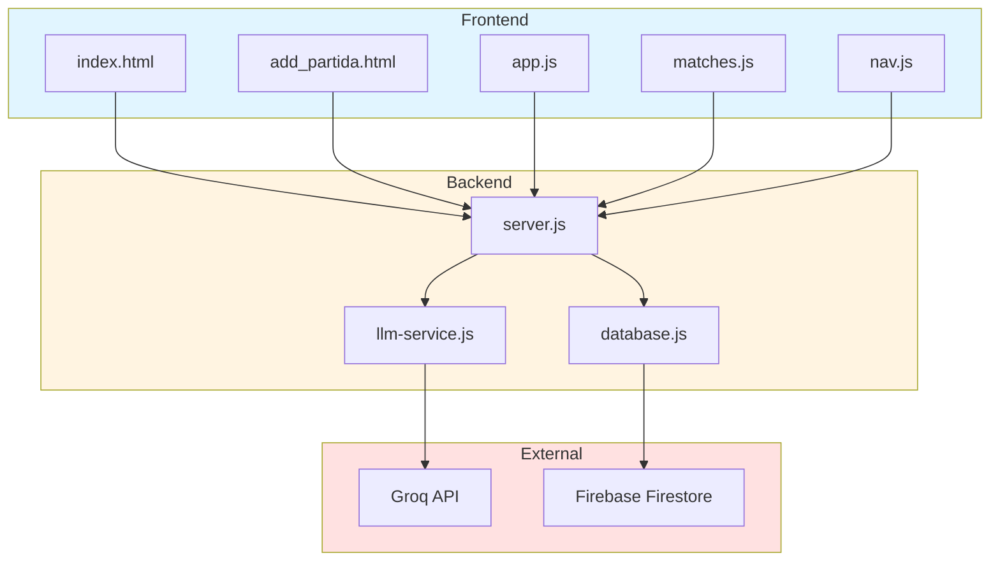

# Design Document: Documentação Completa do Projeto JHD Managers

## Overview

Este documento especifica o design da documentação técnica completa para o projeto JHD Managers, um sistema de análise automática de partidas do EA FC 26 usando inteligência artificial. A documentação será estruturada em múltiplos documentos especializados que cobrem arquitetura, APIs, banco de dados, guias de desenvolvimento, deploy, troubleshooting e segurança.

### Objetivos do Design

1. Criar uma estrutura de documentação modular e navegável
2. Fornecer documentação técnica detalhada para desenvolvedores
3. Incluir guias práticos para configuração, desenvolvimento e deploy
4. Documentar todos os componentes do sistema com exemplos reais
5. Estabelecer padrões de documentação para manutenção futura

### Escopo

A documentação cobrirá:
- Arquitetura completa do sistema (backend, frontend, IA, banco de dados)
- Especificação detalhada de todos os endpoints da API REST
- Estrutura e schema do Firebase Firestore
- Guias passo a passo para desenvolvimento e deploy
- Documentação do serviço de IA (Groq LLM Vision)
- Troubleshooting e resolução de problemas comuns
- Práticas de segurança e boas práticas

### Estrutura da Documentação

A documentação será organizada em arquivos Markdown na pasta `/docs`:

```
docs/
├── README.md                    # Índice principal da documentação
├── architecture/
│   ├── overview.md             # Visão geral da arquitetura
│   ├── data-flow.md            # Fluxo de dados detalhado
│   └── diagrams/               # Diagramas Mermaid
├── api/
│   ├── endpoints.md            # Documentação de todos os endpoints
│   └── examples.md             # Exemplos de requisições/respostas
├── database/
│   ├── schema.md               # Estrutura do Firestore
│   └── queries.md              # Exemplos de queries
├── guides/
│   ├── development-setup.md    # Configuração do ambiente dev
│   ├── deployment.md           # Guia de deploy
│   └── troubleshooting.md      # Resolução de problemas
├── services/
│   ├── llm-service.md          # Documentação do serviço de IA
│   └── frontend.md             # Documentação do frontend
└── security/
    └── best-practices.md       # Segurança e boas práticas
```

## Architecture

### Visão Geral da Arquitetura

O sistema JHD Managers segue uma arquitetura de três camadas com integração de serviços externos:

```
┌─────────────────────────────────────────────────────────────┐
│                        FRONTEND                              │
│  (HTML/CSS/JavaScript - Servido como arquivos estáticos)    │
│                                                              │
│  • index.html - Dashboard e listagem de partidas            │
│  • add_partida.html - Upload de imagens                     │
│  • app.js, matches.js, nav.js - Lógica do cliente          │
└──────────────────────┬──────────────────────────────────────┘
                       │ HTTP/REST
                       ▼
┌─────────────────────────────────────────────────────────────┐
│                    BACKEND (Node.js + Express)               │
│                                                              │
│  • server.js - Servidor HTTP e rotas                        │
│  • Middleware: multer (upload), express.static              │
│  • Rotas REST: /api/upload, /api/matches, /api/matches/:id │
└───────────┬────────────────────────────┬────────────────────┘
            │                            │
            │ Groq SDK                   │ Firebase Admin SDK
            ▼                            ▼
┌──────────────────────┐    ┌──────────────────────────────┐
│   GROQ API (LLM)     │    │   FIREBASE FIRESTORE         │
│                      │    │                              │
│  • llama-4-scout     │    │  Collections:                │
│  • Vision Model      │    │  • matches (partidas)        │
│  • Extração de dados │    │  • counters (IDs)            │
└──────────────────────┘    └──────────────────────────────┘
```

### Componentes Principais

#### 1. Frontend (Cliente Web)

**Tecnologias:** HTML5, CSS3, JavaScript Vanilla

**Responsabilidades:**
- Interface de usuário responsiva (desktop e mobile)
- Upload de imagens de partidas
- Visualização de histórico de partidas
- Dashboard com estatísticas detalhadas
- Modal para exibição de análises táticas

**Arquivos:**
- `public/index.html` - Página principal com listagem de partidas
- `public/add_partida.html` - Formulário de upload
- `public/app.js` - Lógica de upload e preview de imagens
- `public/matches.js` - Renderização de partidas e modal
- `public/nav.js` - Navegação responsiva (hamburger menu)
- `public/style.css` - Estilos globais

#### 2. Backend (Servidor API)

**Tecnologias:** Node.js 18+, Express.js

**Responsabilidades:**
- Servir arquivos estáticos do frontend
- Processar uploads de imagens (multer)
- Orquestrar extração de dados via LLM
- Gerenciar operações CRUD no Firestore
- Tratamento de erros e logging

**Arquivos:**
- `server.js` - Configuração do Express e rotas
- `database.js` - Camada de acesso ao Firestore
- `llm-service.js` - Integração com Groq API

#### 3. Serviço de IA (LLM Vision)

**Tecnologias:** Groq SDK, llama-4-scout-17b-16e-instruct

**Responsabilidades:**
- Converter imagens para base64
- Enviar imagens e prompt para Groq API
- Extrair ~30 estatísticas de partidas
- Gerar análise tática em português brasileiro
- Retornar dados estruturados em JSON

**Configuração:**
- Temperature: 0.3 (baixa variabilidade)
- Max tokens: 3000
- Modelo: meta-llama/llama-4-scout-17b-16e-instruct

#### 4. Banco de Dados (Firebase Firestore)

**Tecnologias:** Firebase Admin SDK, Firestore (NoSQL)

**Responsabilidades:**
- Armazenar dados de partidas
- Gerenciar IDs incrementais via collection "counters"
- Ordenação por data de partida
- Timestamps automáticos de upload

**Collections:**
- `matches` - Documentos de partidas
- `counters` - Controle de IDs incrementais

### Padrão Arquitetural

O sistema utiliza o padrão **API REST com Frontend Estático**:

1. **Separação de Responsabilidades:**
   - Frontend: Apresentação e interação com usuário
   - Backend: Lógica de negócio e orquestração
   - Serviços Externos: Processamento especializado (IA, persistência)

2. **Comunicação:**
   - Frontend ↔ Backend: HTTP/REST (JSON)
   - Backend ↔ Groq: HTTP/REST (JSON com imagens base64)
   - Backend ↔ Firestore: Firebase Admin SDK

3. **Fluxo de Dados Unidirecional:**
   - Upload → Processamento → Armazenamento → Visualização

4. **Stateless:**
   - Backend não mantém estado de sessão
   - Todas as informações persistidas no Firestore

## Components and Interfaces

### 1. Frontend Components

#### 1.1 Upload Component (`add_partida.html` + `app.js`)

**Interface:**
```javascript
// Função principal de upload
async function uploadMatch(imageFile, matchDate)

// Retorno esperado
{
  success: boolean,
  message: string,
  matchId?: number
}
```

**Funcionalidades:**
- Preview de imagem antes do upload
- Validação de formato (JPEG, PNG)
- Validação de data da partida
- Feedback visual de progresso
- Redirecionamento após sucesso

**Fluxo:**
1. Usuário seleciona imagem → Preview exibido
2. Usuário preenche data da partida
3. Clica em "Adicionar Partida"
4. FormData enviado via POST para `/api/upload`
5. Aguarda resposta e exibe feedback
6. Redireciona para página principal

#### 1.2 Matches List Component (`index.html` + `matches.js`)

**Interface:**
```javascript
// Função de carregamento de partidas
async function loadMatches()

// Função de renderização
function renderMatch(match)

// Função de exclusão
async function deleteMatch(firestoreId)

// Função de modal
function showMatchDetails(match)
```

**Funcionalidades:**
- Listagem de partidas ordenadas por data
- Card visual para cada partida
- Modal com estatísticas detalhadas
- Botão de exclusão com confirmação
- Indicadores visuais (vitória/empate/derrota)

#### 1.3 Navigation Component (`nav.js`)

**Interface:**
```javascript
// Toggle do menu mobile
function toggleMenu()
```

**Funcionalidades:**
- Menu responsivo (hamburger)
- Navegação entre páginas
- Destaque da página ativa

### 2. Backend Components

#### 2.1 Server Module (`server.js`)

**Interface:**
```javascript
// Rotas expostas
POST   /api/upload          // Upload e processamento de partida
GET    /api/matches         // Listar todas as partidas
GET    /api/matches/:id     // Obter partida específica
DELETE /api/matches/:id     // Excluir partida
GET    /                    // Servir frontend estático
```

**Middleware:**
- `express.json()` - Parse de JSON
- `express.static('public')` - Servir arquivos estáticos
- `multer({ dest: 'uploads/' })` - Upload de arquivos

**Configuração:**
```javascript
const PORT = process.env.PORT || 3000;
app.listen(PORT, () => {
  console.log(`Servidor rodando na porta ${PORT}`);
});
```

#### 2.2 Database Module (`database.js`)

**Interface:**
```javascript
// Operações CRUD
async function insertMatch(matchData, matchDate): Promise<{firestoreId, matchId}>
async function getAllMatches(): Promise<Match[]>
async function getMatchById(id): Promise<Match | null>
async function deleteMatch(matchId): Promise<boolean>

// Função auxiliar
async function getNextMatchId(): Promise<number>
```

**Tipos:**
```typescript
interface Match {
  id: string;                    // Firestore document ID
  match_id: number;              // ID incremental
  match_date: string;            // Data da partida (YYYY-MM-DD)
  upload_date: string;           // Timestamp ISO do upload
  home_team: string;
  away_team: string;
  home_score: number;
  away_score: number;
  // ... ~30 campos de estatísticas
  match_analysis: string;        // Análise tática gerada por IA
  raw_data: string;              // JSON original da extração
}
```

**Inicialização:**
```javascript
// Carrega credenciais do Firebase
const serviceAccountPath = process.env.FIREBASE_SERVICE_ACCOUNT_PATH || './firebase-credentials.json';
const serviceAccount = JSON.parse(readFileSync(serviceAccountPath, 'utf8'));

admin.initializeApp({
  credential: admin.credential.cert(serviceAccount)
});

const db = admin.firestore();
```

#### 2.3 LLM Service Module (`llm-service.js`)

**Interface:**
```javascript
async function extractMatchData(imagePath): Promise<MatchData>
```

**Tipos:**
```typescript
interface MatchData {
  home_team: string;
  away_team: string;
  home_score: number;
  away_score: number;
  home_shots: number;
  away_shots: number;
  home_possession: number;
  away_possession: number;
  dribbles_completed_rate_home: number;
  dribbles_completed_rate_away: number;
  shot_accuracy_home: number;
  shot_accuracy_away: number;
  pass_accuracy_home: number;
  pass_accuracy_away: number;
  ball_recovery_time: number;
  expected_goals_home: number;
  expected_goals_away: number;
  passes_home: number;
  passes_away: number;
  duels_won_home: number;
  duels_won_away: number;
  duels_lost_home: number;
  duels_lost_away: number;
  interceptions_home: number;
  interceptions_away: number;
  blocks_home: number;
  blocks_away: number;
  fouls_committed_home: number;
  fouls_committed_away: number;
  offsides_home: number;
  offsides_away: number;
  corners_home: number;
  corners_away: number;
  fouls_home: number;
  fouls_away: number;
  penalties_home: number;
  penalties_away: number;
  yellow_cards_home: number;
  yellow_cards_away: number;
  match_analysis: string;
}
```

**Processo:**
1. Lê arquivo de imagem do disco
2. Converte para base64
3. Cria URL data: `data:image/jpeg;base64,${imageBase64}`
4. Monta prompt em português brasileiro
5. Envia para Groq API com modelo llama-4-scout
6. Extrai JSON da resposta usando regex
7. Retorna objeto MatchData

### 3. External Service Interfaces

#### 3.1 Groq API Interface

**Endpoint:** `https://api.groq.com/openai/v1/chat/completions`

**Request:**
```javascript
{
  model: "meta-llama/llama-4-scout-17b-16e-instruct",
  messages: [
    {
      role: "user",
      content: [
        { type: "text", text: "<prompt>" },
        { type: "image_url", image_url: { url: "<data:image/jpeg;base64,...>" } }
      ]
    }
  ],
  temperature: 0.3,
  max_tokens: 3000
}
```

**Response:**
```javascript
{
  choices: [
    {
      message: {
        content: "{ \"home_team\": \"...\", ... }"
      }
    }
  ]
}
```

#### 3.2 Firebase Firestore Interface

**Operações Utilizadas:**

```javascript
// Adicionar documento
await matchesCollection.add(documentData);

// Listar com ordenação
await matchesCollection.orderBy('match_date', 'desc').get();

// Obter documento específico
await matchesCollection.doc(id).get();

// Excluir documento
await matchesCollection.doc(id).delete();

// Transação (para IDs incrementais)
await db.runTransaction(async (transaction) => {
  const doc = await transaction.get(counterDoc);
  const newId = doc.data().current_id + 1;
  transaction.update(counterDoc, { current_id: newId });
  return newId;
});
```

## Data Models

### 1. Match Document (Firestore)

**Collection:** `matches`

**Schema:**
```javascript
{
  // Identificação
  match_id: number,              // ID incremental (1, 2, 3, ...)
  match_date: string,            // Data da partida (formato: "YYYY-MM-DD")
  upload_date: Timestamp,        // Timestamp do Firestore (auto)
  
  // Times e Placar
  home_team: string,             // Nome do time da casa
  away_team: string,             // Nome do time visitante
  home_score: number,            // Gols do time da casa
  away_score: number,            // Gols do time visitante
  
  // Estatísticas de Ataque
  home_shots: number,            // Chutes a gol (casa)
  away_shots: number,            // Chutes a gol (visitante)
  shot_accuracy_home: number,    // Precisão de chute % (casa)
  shot_accuracy_away: number,    // Precisão de chute % (visitante)
  expected_goals_home: number,   // xG (casa)
  expected_goals_away: number,   // xG (visitante)
  
  // Posse e Passes
  home_possession: number,       // Posse de bola % (casa)
  away_possession: number,       // Posse de bola % (visitante)
  passes_home: number,           // Total de passes (casa)
  passes_away: number,           // Total de passes (visitante)
  pass_accuracy_home: number,    // Precisão de passe % (casa)
  pass_accuracy_away: number,    // Precisão de passe % (visitante)
  
  // Dribles
  dribbles_completed_rate_home: number,  // Taxa de dribles % (casa)
  dribbles_completed_rate_away: number,  // Taxa de dribles % (visitante)
  
  // Duelos e Defesa
  duels_won_home: number,        // Duelos ganhos (casa)
  duels_won_away: number,        // Duelos ganhos (visitante)
  duels_lost_home: number,       // Duelos perdidos (casa)
  duels_lost_away: number,       // Duelos perdidos (visitante)
  interceptions_home: number,    // Interceptações (casa)
  interceptions_away: number,    // Interceptações (visitante)
  blocks_home: number,           // Bloqueios (casa)
  blocks_away: number,           // Bloqueios (visitante)
  ball_recovery_time: number,    // Tempo de recuperação (segundos)
  
  // Disciplina
  fouls_committed_home: number,  // Faltas cometidas (casa)
  fouls_committed_away: number,  // Faltas cometidas (visitante)
  fouls_home: number,            // Faltas sofridas (casa)
  fouls_away: number,            // Faltas sofridas (visitante)
  yellow_cards_home: number,     // Cartões amarelos (casa)
  yellow_cards_away: number,     // Cartões amarelos (visitante)
  
  // Outras Estatísticas
  offsides_home: number,         // Impedimentos (casa)
  offsides_away: number,         // Impedimentos (visitante)
  corners_home: number,          // Escanteios (casa)
  corners_away: number,          // Escanteios (visitante)
  penalties_home: number,        // Pênaltis (casa)
  penalties_away: number,        // Pênaltis (visitante)
  
  // Análise e Dados Brutos
  match_analysis: string,        // Análise tática gerada por IA (150-200 palavras)
  raw_data: string               // JSON original da extração (para debug)
}
```

**Exemplo Real:**
```json
{
  "match_id": 1,
  "match_date": "2024-01-15",
  "upload_date": "2024-01-15T18:30:00.000Z",
  "home_team": "Manchester City",
  "away_team": "Liverpool",
  "home_score": 2,
  "away_score": 1,
  "home_shots": 15,
  "away_shots": 8,
  "home_possession": 62,
  "away_possession": 38,
  "shot_accuracy_home": 67,
  "shot_accuracy_away": 50,
  "pass_accuracy_home": 89,
  "pass_accuracy_away": 82,
  "dribbles_completed_rate_home": 75,
  "dribbles_completed_rate_away": 60,
  "expected_goals_home": 2.3,
  "expected_goals_away": 0.8,
  "passes_home": 542,
  "passes_away": 318,
  "duels_won_home": 28,
  "duels_won_away": 22,
  "duels_lost_home": 18,
  "duels_lost_away": 24,
  "interceptions_home": 12,
  "interceptions_away": 15,
  "blocks_home": 5,
  "blocks_away": 8,
  "ball_recovery_time": 8,
  "fouls_committed_home": 10,
  "fouls_committed_away": 14,
  "fouls_home": 14,
  "fouls_away": 10,
  "offsides_home": 2,
  "offsides_away": 4,
  "corners_home": 7,
  "corners_away": 3,
  "penalties_home": 0,
  "penalties_away": 0,
  "yellow_cards_home": 2,
  "yellow_cards_away": 3,
  "match_analysis": "O Manchester City dominou a partida com 62% de posse de bola e 542 passes completados, demonstrando seu estilo de jogo característico. A eficiência ofensiva foi superior, com 15 chutes e xG de 2.3, refletindo a qualidade das chances criadas. O Liverpool, apesar da menor posse, mostrou solidez defensiva com 15 interceptações e 8 bloqueios. A diferença no meio-campo foi decisiva, com o City vencendo mais duelos (28 vs 22) e mantendo maior precisão nos passes (89% vs 82%). A disciplina foi um ponto de atenção para ambos os times, com 24 faltas cometidas no total. O resultado justo reflete a superioridade técnica e tática do Manchester City nesta partida virtual do EA FC 26.",
  "raw_data": "{\"home_team\":\"Manchester City\",\"away_team\":\"Liverpool\",...}"
}
```

### 2. Counter Document (Firestore)

**Collection:** `counters`
**Document ID:** `match_counter`

**Schema:**
```javascript
{
  current_id: number  // Último ID utilizado
}
```

**Exemplo:**
```json
{
  "current_id": 42
}
```

**Funcionamento:**
- Inicializado com `current_id: 1` na primeira partida
- Incrementado atomicamente via transação do Firestore
- Garante IDs únicos e sequenciais
- Usado para gerar `match_id` em cada nova partida

### 3. Upload Request (API)

**Endpoint:** `POST /api/upload`

**Content-Type:** `multipart/form-data`

**Campos:**
```javascript
{
  image: File,        // Arquivo de imagem (JPEG/PNG)
  matchDate: string   // Data da partida (formato: "YYYY-MM-DD")
}
```

**Exemplo (FormData):**
```javascript
const formData = new FormData();
formData.append('image', fileInput.files[0]);
formData.append('matchDate', '2024-01-15');

await fetch('/api/upload', {
  method: 'POST',
  body: formData
});
```

### 4. API Response Models

#### Success Response
```javascript
{
  success: true,
  message: string,
  data?: any
}
```

#### Error Response
```javascript
{
  success: false,
  error: string
}
```

#### Match List Response
```javascript
{
  success: true,
  data: Match[]
}
```

#### Upload Response
```javascript
{
  success: true,
  message: "Partida adicionada com sucesso!",
  data: {
    firestoreId: string,
    matchId: number
  }
}
```

## Data Flow Diagrams

### 1. Fluxo Completo de Upload e Processamento



### 2. Fluxo de Listagem de Partidas



### 3. Fluxo de Exclusão de Partida



### 4. Transformação de Dados (Imagem → JSON → Firestore)


### 5. Arquitetura de Componentes




## Correctness Properties

*A property is a characteristic or behavior that should hold true across all valid executions of a system-essentially, a formal statement about what the system should do. Properties serve as the bridge between human-readable specifications and machine-verifiable correctness guarantees.*

### Property Reflection

Após análise dos 67 critérios de aceitação, identifiquei que todos são testáveis como exemplos específicos (verificação de presença de conteúdo na documentação). Não há propriedades universais no sentido tradicional de property-based testing, pois estamos criando documentação estática, não software com comportamento dinâmico.

Os critérios se agrupam em categorias de verificação:

1. **Completude de Conteúdo**: Verificar se todos os elementos necessários estão presentes
2. **Estrutura de Documentos**: Verificar se a organização está correta
3. **Exemplos e Diagramas**: Verificar se há exemplos práticos e visuais

Como estamos gerando documentação (artefatos estáticos), as "propriedades" são na verdade checklists de completude. Não há comportamento a ser testado com múltiplas entradas aleatórias.

### Propriedades de Documentação

Dado que este é um projeto de documentação, as propriedades são verificações de completude e qualidade dos documentos gerados:

### Property 1: Completude da Documentação de Arquitetura

*Para qualquer* documento de arquitetura gerado, ele deve conter: (1) descrição completa da stack tecnológica (Node.js, Express, Groq SDK, Firebase Firestore, HTML/CSS/JavaScript), (2) documentação de todos os componentes principais (Backend, Frontend, Serviço de IA, Banco de Dados), (3) explicação do padrão arquitetural (API REST com frontend estático), (4) pelo menos um diagrama visual da arquitetura, e (5) descrição das responsabilidades de cada camada.

**Validates: Requirements 1.1, 1.2, 1.3, 1.4, 1.5**

### Property 2: Completude dos Diagramas de Fluxo de Dados

*Para qualquer* diagrama de fluxo de dados gerado, ele deve ilustrar: (1) o fluxo completo desde upload até visualização, (2) integração com Groq API, (3) processo de armazenamento no Firestore, e (4) todos os pontos de transformação de dados (imagem → base64 → JSON → Firestore).

**Validates: Requirements 2.1, 2.2, 2.3, 2.4, 2.5**

### Property 3: Completude do Schema do Banco de Dados

*Para qualquer* documentação de schema gerada, ela deve conter: (1) documentação da coleção "matches" com todos os ~30 campos e tipos, (2) documentação da coleção "counters" e sistema de ID incremental, (3) especificação de campos obrigatórios e opcionais, (4) exemplos de documentos JSON reais, (5) documentação de índices de ordenação, e (6) lista completa de todas as estatísticas extraídas.

**Validates: Requirements 3.1, 3.2, 3.3, 3.4, 3.5, 3.6**

### Property 4: Completude da Documentação de API

*Para qualquer* documentação de API gerada, ela deve incluir: (1) documentação do endpoint POST /api/upload com parâmetros, (2) documentação do endpoint GET /api/matches, (3) documentação do endpoint DELETE /api/matches/:id, (4) exemplos de requisições e respostas para cada endpoint, (5) códigos de status HTTP (200, 400, 500), (6) formatos de erro, e (7) headers necessários.

**Validates: Requirements 4.1, 4.2, 4.3, 4.4, 4.5, 4.6, 4.7**

### Property 5: Completude do Guia de Desenvolvimento

*Para qualquer* guia de desenvolvimento gerado, ele deve conter: (1) lista de pré-requisitos (Node.js >= 18.0.0, npm, conta Groq, conta Firebase), (2) processo de clonagem e instalação, (3) instruções para configurar GROQ_API_KEY, (4) instruções para configurar Firebase, (5) comandos para iniciar o servidor, (6) instruções de teste do ambiente, e (7) documentação da estrutura de diretórios.

**Validates: Requirements 5.1, 5.2, 5.3, 5.4, 5.5, 5.6, 5.7**

### Property 6: Completude do Guia de Deploy

*Para qualquer* guia de deploy gerado, ele deve documentar: (1) variáveis de ambiente necessárias em produção, (2) instruções para pelo menos uma plataforma de deploy, (3) configurações de segurança (CORS, rate limiting), (4) requisitos de recursos, (5) checklist pós-deploy, (6) estratégias de backup do Firestore, e (7) configuração de domínio customizado e HTTPS.

**Validates: Requirements 6.1, 6.2, 6.3, 6.4, 6.5, 6.6, 6.7**

### Property 7: Completude do Guia de Troubleshooting

*Para qualquer* guia de troubleshooting gerado, ele deve incluir: (1) erros comuns de GROQ_API_KEY, (2) erros de conexão com Firebase, (3) soluções para problemas de upload, (4) erros de extração via LLM, (5) comandos de diagnóstico, (6) problemas de timezone, e (7) exemplos de logs.

**Validates: Requirements 7.1, 7.2, 7.3, 7.4, 7.5, 7.6, 7.7**

### Property 8: Completude da Documentação do Serviço de IA

*Para qualquer* documentação do serviço de IA gerada, ela deve conter: (1) especificação do modelo LLM (llama-4-scout-17b-16e-instruct), (2) explicação da conversão para base64, (3) estrutura do prompt, (4) lista de todos os ~30 campos extraídos, (5) parâmetros da API (temperature: 0.3, max_tokens: 3000), (6) tratamento de valores null, e (7) exemplos de respostas da API.

**Validates: Requirements 8.1, 8.2, 8.3, 8.4, 8.5, 8.6, 8.7**

### Property 9: Completude da Documentação do Frontend

*Para qualquer* documentação do frontend gerada, ela deve documentar: (1) estrutura de páginas (index.html, add_partida.html), (2) scripts JavaScript (app.js, matches.js, nav.js), (3) sistema de modal, (4) navegação responsiva, (5) funcionalidades de cada página, (6) sistema de preview de imagens, e (7) renderização dinâmica de dados.

**Validates: Requirements 9.1, 9.2, 9.3, 9.4, 9.5, 9.6, 9.7**

### Property 10: Completude da Documentação de Segurança

*Para qualquer* documentação de segurança gerada, ela deve incluir: (1) uso de variáveis de ambiente, (2) aviso sobre não commitar credenciais, (3) validações de entrada, (4) práticas de segurança para produção, (5) tratamento de erros seguro, (6) recomendações para rotação de API keys, e (7) regras de segurança do Firestore.

**Validates: Requirements 10.1, 10.2, 10.3, 10.4, 10.5, 10.6, 10.7**

## Error Handling

### Estratégia de Tratamento de Erros na Documentação

#### 1. Documentação Incompleta

**Problema:** Documentação gerada não contém todos os elementos necessários.

**Solução:**
- Implementar checklist de validação antes de considerar documento completo
- Usar as propriedades de completude como critérios de validação
- Revisar manualmente cada documento contra os requisitos

#### 2. Exemplos Desatualizados

**Problema:** Exemplos de código ou configuração ficam desatualizados com mudanças no projeto.

**Solução:**
- Extrair exemplos diretamente do código fonte quando possível
- Incluir data de última atualização em cada documento
- Estabelecer processo de revisão periódica (trimestral)
- Testar exemplos de código antes de incluir na documentação

#### 3. Diagramas Inconsistentes

**Problema:** Diagramas não refletem a arquitetura real do sistema.

**Solução:**
- Gerar diagramas a partir do código quando possível
- Validar diagramas com desenvolvedores do projeto
- Manter diagramas em formato editável (Mermaid)
- Incluir legenda e descrição detalhada

#### 4. Informações Sensíveis Expostas

**Problema:** Documentação pode acidentalmente expor credenciais ou informações sensíveis.

**Solução:**
- Usar placeholders para todas as credenciais (ex: `your_api_key_here`)
- Revisar todos os exemplos antes de publicar
- Nunca incluir valores reais de produção
- Documentar claramente onde obter credenciais

#### 5. Instruções Ambíguas

**Problema:** Guias podem ser mal interpretados por desenvolvedores.

**Solução:**
- Usar linguagem clara e objetiva
- Incluir exemplos práticos para cada instrução
- Numerar passos sequenciais
- Incluir screenshots quando apropriado
- Testar instruções com desenvolvedor que não conhece o projeto

### Validação de Documentação

#### Checklist de Qualidade

Antes de considerar a documentação completa, verificar:

- [ ] Todos os requisitos foram atendidos
- [ ] Todos os diagramas estão presentes e corretos
- [ ] Exemplos de código foram testados
- [ ] Não há informações sensíveis expostas
- [ ] Links internos funcionam corretamente
- [ ] Formatação Markdown está correta
- [ ] Código está com syntax highlighting apropriado
- [ ] Índice/sumário está atualizado
- [ ] Glossário está completo
- [ ] Referências cruzadas estão corretas

#### Processo de Revisão

1. **Auto-revisão:** Autor verifica contra checklist
2. **Revisão técnica:** Desenvolvedor valida precisão técnica
3. **Revisão de usabilidade:** Novo desenvolvedor testa instruções
4. **Aprovação final:** Tech lead aprova para publicação

## Testing Strategy

### Abordagem de Testes para Documentação

Como este projeto gera documentação (artefatos estáticos), a estratégia de testes difere de projetos de software tradicional. Não há property-based testing no sentido de gerar entradas aleatórias, mas sim validação de completude e qualidade.

### 1. Testes de Completude (Unit Tests)

Verificar se cada documento contém todos os elementos necessários:

```javascript
describe('Architecture Documentation', () => {
  let doc;
  
  beforeAll(() => {
    doc = fs.readFileSync('docs/architecture/overview.md', 'utf8');
  });
  
  test('should mention all stack technologies', () => {
    expect(doc).toContain('Node.js');
    expect(doc).toContain('Express');
    expect(doc).toContain('Groq SDK');
    expect(doc).toContain('Firebase Firestore');
    expect(doc).toContain('HTML');
    expect(doc).toContain('CSS');
    expect(doc).toContain('JavaScript');
  });
  
  test('should document all main components', () => {
    expect(doc).toContain('Backend');
    expect(doc).toContain('Frontend');
    expect(doc).toContain('IA');
    expect(doc).toContain('Banco de Dados');
  });
  
  test('should include architecture diagram', () => {
    expect(doc).toMatch(/```mermaid/);
  });
});
```

### 2. Testes de Validação de Exemplos

Verificar se exemplos de código são válidos:

```javascript
describe('API Examples', () => {
  test('upload example should be valid JavaScript', () => {
    const exampleCode = extractCodeBlock('docs/api/examples.md', 'upload');
    expect(() => {
      new Function(exampleCode);
    }).not.toThrow();
  });
  
  test('JSON examples should be valid', () => {
    const jsonExample = extractCodeBlock('docs/database/schema.md', 'match-example');
    expect(() => {
      JSON.parse(jsonExample);
    }).not.toThrow();
  });
});
```

### 3. Testes de Links e Referências

Verificar se links internos funcionam:

```javascript
describe('Documentation Links', () => {
  test('all internal links should resolve', () => {
    const docs = getAllMarkdownFiles('docs/');
    docs.forEach(doc => {
      const links = extractInternalLinks(doc);
      links.forEach(link => {
        expect(fs.existsSync(link)).toBe(true);
      });
    });
  });
});
```

### 4. Testes de Diagramas Mermaid

Verificar se diagramas são válidos:

```javascript
describe('Mermaid Diagrams', () => {
  test('all diagrams should have valid syntax', async () => {
    const diagrams = extractMermaidDiagrams('docs/');
    for (const diagram of diagrams) {
      const result = await validateMermaid(diagram);
      expect(result.valid).toBe(true);
    }
  });
});
```

### 5. Testes de Segurança

Verificar se não há informações sensíveis:

```javascript
describe('Security Checks', () => {
  test('should not contain real API keys', () => {
    const docs = getAllMarkdownFiles('docs/');
    docs.forEach(doc => {
      const content = fs.readFileSync(doc, 'utf8');
      expect(content).not.toMatch(/gsk_[a-zA-Z0-9]{32}/); // Groq API key pattern
      expect(content).not.toMatch(/"private_key":\s*"-----BEGIN/); // Firebase private key
    });
  });
  
  test('should use placeholders for credentials', () => {
    const envDoc = fs.readFileSync('docs/guides/development-setup.md', 'utf8');
    expect(envDoc).toContain('your_api_key_here');
    expect(envDoc).toContain('sua_chave_groq_aqui');
  });
});
```

### 6. Testes de Formatação

Verificar se Markdown está bem formatado:

```javascript
describe('Markdown Formatting', () => {
  test('all code blocks should have language specified', () => {
    const docs = getAllMarkdownFiles('docs/');
    docs.forEach(doc => {
      const content = fs.readFileSync(doc, 'utf8');
      const codeBlocks = content.match(/```(\w*)\n/g) || [];
      codeBlocks.forEach(block => {
        expect(block).not.toBe('```\n'); // Should have language
      });
    });
  });
  
  test('headings should follow hierarchy', () => {
    const docs = getAllMarkdownFiles('docs/');
    docs.forEach(doc => {
      const headings = extractHeadings(doc);
      validateHeadingHierarchy(headings); // No jumps from # to ###
    });
  });
});
```

### 7. Testes de Propriedades (Validação de Completude)

Implementar as 10 propriedades de completude como testes:

```javascript
describe('Property 1: Architecture Documentation Completeness', () => {
  test('should satisfy all architecture requirements', () => {
    const doc = fs.readFileSync('docs/architecture/overview.md', 'utf8');
    
    // Requirement 1.1: Stack tecnológica completa
    expect(doc).toContain('Node.js');
    expect(doc).toContain('Express');
    expect(doc).toContain('Groq SDK');
    expect(doc).toContain('Firebase Firestore');
    
    // Requirement 1.2: Componentes principais
    expect(doc).toContain('Backend');
    expect(doc).toContain('Frontend');
    
    // Requirement 1.3: Padrão arquitetural
    expect(doc).toContain('API REST');
    
    // Requirement 1.4: Diagrama visual
    expect(doc).toMatch(/```mermaid/);
    
    // Requirement 1.5: Responsabilidades
    expect(doc).toContain('Responsabilidades');
  });
});

// Similar tests for Properties 2-10...
```

### 8. Testes de Usabilidade (Manual)

Checklist para teste manual com novo desenvolvedor:

1. **Setup do Ambiente:**
   - [ ] Conseguiu seguir o guia de desenvolvimento sem ajuda?
   - [ ] Todos os comandos funcionaram como documentado?
   - [ ] Conseguiu configurar Firebase e Groq API?

2. **Compreensão da Arquitetura:**
   - [ ] Entendeu o fluxo de dados?
   - [ ] Conseguiu localizar componentes no código?
   - [ ] Diagramas foram úteis?

3. **Uso da API:**
   - [ ] Conseguiu fazer requisições usando exemplos?
   - [ ] Entendeu os formatos de resposta?
   - [ ] Conseguiu tratar erros adequadamente?

4. **Troubleshooting:**
   - [ ] Conseguiu resolver problemas usando o guia?
   - [ ] Comandos de diagnóstico foram úteis?

### 9. Ferramentas de Teste

**Bibliotecas recomendadas:**
- `jest` - Framework de testes
- `markdown-link-check` - Validar links
- `markdownlint` - Linting de Markdown
- `mermaid-cli` - Validar diagramas Mermaid

**Configuração de CI/CD:**
```yaml
# .github/workflows/docs-validation.yml
name: Documentation Validation

on: [push, pull_request]

jobs:
  validate:
    runs-on: ubuntu-latest
    steps:
      - uses: actions/checkout@v2
      - uses: actions/setup-node@v2
      - run: npm install
      - run: npm run test:docs
      - run: npm run lint:markdown
      - run: npm run check:links
```

### 10. Métricas de Qualidade

**Indicadores de qualidade da documentação:**
- Cobertura de requisitos: 100% (todos os 67 critérios atendidos)
- Links quebrados: 0
- Exemplos inválidos: 0
- Informações sensíveis expostas: 0
- Tempo médio de setup (novo dev): < 30 minutos
- Taxa de sucesso no primeiro deploy: > 90%

### Resumo da Estratégia

1. **Testes Automatizados:** Validar completude, links, exemplos, segurança
2. **Testes Manuais:** Usabilidade com desenvolvedores reais
3. **Revisão por Pares:** Validação técnica e de clareza
4. **CI/CD:** Validação automática em cada commit
5. **Métricas:** Acompanhar qualidade ao longo do tempo

Esta abordagem garante que a documentação seja completa, precisa, segura e útil para desenvolvedores.


## Documentation Structure Details

### Estrutura Detalhada de Cada Documento

#### 1. docs/README.md - Índice Principal

**Propósito:** Ponto de entrada para toda a documentação

**Estrutura:**
```markdown
# Documentação JHD Managers

Bem-vindo à documentação completa do JHD Managers.

## 📚 Índice

### Começando
- [Guia de Configuração do Ambiente](guides/development-setup.md)
- [Guia de Deploy](guides/deployment.md)

### Arquitetura
- [Visão Geral da Arquitetura](architecture/overview.md)
- [Fluxo de Dados](architecture/data-flow.md)

### Referência Técnica
- [API Endpoints](api/endpoints.md)
- [Exemplos de API](api/examples.md)
- [Schema do Banco de Dados](database/schema.md)
- [Queries do Firestore](database/queries.md)

### Serviços
- [Serviço de IA (LLM)](services/llm-service.md)
- [Frontend](services/frontend.md)

### Operações
- [Troubleshooting](guides/troubleshooting.md)
- [Segurança e Boas Práticas](security/best-practices.md)

## 🚀 Quick Start

[Instruções rápidas para começar]

## 📖 Sobre o Projeto

[Descrição breve do JHD Managers]
```

#### 2. docs/architecture/overview.md

**Propósito:** Documentar arquitetura completa do sistema

**Seções:**
1. **Introdução:** Visão geral do sistema
2. **Stack Tecnológica:** Lista completa de tecnologias
3. **Componentes Principais:** Backend, Frontend, IA, Database
4. **Padrão Arquitetural:** Explicação do padrão REST
5. **Diagrama de Arquitetura:** Mermaid diagram
6. **Responsabilidades:** Detalhamento de cada camada
7. **Decisões de Design:** Justificativas técnicas

**Exemplo de conteúdo:**
```markdown
## Stack Tecnológica

### Backend
- **Node.js 18+**: Runtime JavaScript
- **Express.js**: Framework web minimalista
- **Multer**: Middleware para upload de arquivos
- **Firebase Admin SDK**: Integração com Firestore

### Frontend
- **HTML5**: Estrutura das páginas
- **CSS3**: Estilização responsiva
- **JavaScript Vanilla**: Lógica do cliente (sem frameworks)

### Serviços Externos
- **Groq API**: Processamento de imagens com LLM
- **Firebase Firestore**: Banco de dados NoSQL
```

#### 3. docs/architecture/data-flow.md

**Propósito:** Documentar fluxo de dados detalhado

**Seções:**
1. **Fluxo de Upload:** Passo a passo do upload
2. **Fluxo de Listagem:** Como partidas são carregadas
3. **Fluxo de Exclusão:** Processo de deleção
4. **Transformações de Dados:** Cada ponto de transformação
5. **Diagramas de Sequência:** Mermaid sequence diagrams
6. **Tratamento de Erros:** Como erros fluem pelo sistema

#### 4. docs/api/endpoints.md

**Propósito:** Referência completa de todos os endpoints

**Formato para cada endpoint:**
```markdown
### POST /api/upload

**Descrição:** Faz upload de imagem de partida e processa automaticamente.

**Content-Type:** `multipart/form-data`

**Parâmetros:**
| Nome | Tipo | Obrigatório | Descrição |
|------|------|-------------|-----------|
| image | File | Sim | Arquivo de imagem (JPEG/PNG) |
| matchDate | String | Sim | Data da partida (YYYY-MM-DD) |

**Resposta de Sucesso (200):**
```json
{
  "success": true,
  "message": "Partida adicionada com sucesso!",
  "data": {
    "firestoreId": "abc123",
    "matchId": 42
  }
}
```

**Respostas de Erro:**
- **400 Bad Request:** Parâmetros inválidos
- **500 Internal Server Error:** Erro no processamento

**Exemplo de Uso:**
```javascript
const formData = new FormData();
formData.append('image', fileInput.files[0]);
formData.append('matchDate', '2024-01-15');

const response = await fetch('/api/upload', {
  method: 'POST',
  body: formData
});
```
```

#### 5. docs/database/schema.md

**Propósito:** Documentar estrutura completa do Firestore

**Seções:**
1. **Visão Geral:** Introdução ao schema
2. **Collection: matches:** Todos os campos com tipos e descrições
3. **Collection: counters:** Sistema de IDs incrementais
4. **Índices:** Índices utilizados para queries
5. **Exemplos de Documentos:** JSON completo de exemplos reais
6. **Regras de Validação:** Campos obrigatórios vs opcionais
7. **Estatísticas Extraídas:** Lista completa das ~30 estatísticas

**Formato de documentação de campos:**
```markdown
| Campo | Tipo | Obrigatório | Descrição | Exemplo |
|-------|------|-------------|-----------|---------|
| match_id | number | Sim | ID incremental único | 42 |
| match_date | string | Sim | Data da partida (YYYY-MM-DD) | "2024-01-15" |
| home_team | string | Sim | Nome do time da casa | "Manchester City" |
| home_shots | number | Não | Chutes a gol do time da casa | 15 |
```

#### 6. docs/guides/development-setup.md

**Propósito:** Guia completo para configurar ambiente de desenvolvimento

**Estrutura:**
```markdown
# Guia de Configuração do Ambiente de Desenvolvimento

## Pré-requisitos

- Node.js >= 18.0.0
- npm >= 9.0.0
- Conta no Groq (gratuita)
- Conta no Firebase (plano gratuito)
- Git

## Passo 1: Clonar o Repositório

[Instruções detalhadas]

## Passo 2: Instalar Dependências

[Comandos e explicações]

## Passo 3: Configurar Groq API

[Como obter API key e configurar]

## Passo 4: Configurar Firebase

[Passo a passo completo com screenshots]

## Passo 5: Configurar Variáveis de Ambiente

[Exemplo de .env com explicações]

## Passo 6: Iniciar o Servidor

[Comandos e verificações]

## Verificação do Ambiente

[Como testar se tudo está funcionando]

## Estrutura de Diretórios

[Árvore de diretórios com explicações]

## Próximos Passos

[Links para outras documentações]
```

#### 7. docs/guides/deployment.md

**Propósito:** Guia completo de deploy em produção

**Seções:**
1. **Preparação:** Checklist pré-deploy
2. **Variáveis de Ambiente:** Lista completa para produção
3. **Deploy no Render:** Passo a passo detalhado
4. **Deploy no Heroku:** Instruções alternativas
5. **Deploy no Railway:** Outra opção
6. **Deploy em VPS:** Para quem prefere controle total
7. **Configurações de Segurança:** CORS, rate limiting, etc.
8. **Requisitos de Recursos:** CPU, memória, storage
9. **Checklist Pós-Deploy:** Verificações necessárias
10. **Backup do Firestore:** Estratégias e automação
11. **Domínio Customizado:** Como configurar
12. **HTTPS:** Configuração de certificados

#### 8. docs/guides/troubleshooting.md

**Propósito:** Resolver problemas comuns rapidamente

**Formato:**
```markdown
## Erro: "GROQ_API_KEY não configurada"

**Sintoma:**
```
✗ Erro ao chamar Groq API: GROQ_API_KEY não configurada no arquivo .env
```

**Causa:** Variável de ambiente não está definida ou arquivo .env não existe.

**Solução:**
1. Verifique se o arquivo `.env` existe na raiz do projeto
2. Abra o arquivo e verifique se contém: `GROQ_API_KEY=sua_chave_aqui`
3. Obtenha sua chave em: https://console.groq.com/keys
4. Reinicie o servidor após configurar

**Comandos de Diagnóstico:**
```bash
# Verificar se .env existe
ls -la .env

# Ver conteúdo (sem expor a chave)
grep GROQ_API_KEY .env
```
```

#### 9. docs/services/llm-service.md

**Propósito:** Documentar serviço de IA em detalhes

**Seções:**
1. **Visão Geral:** O que o serviço faz
2. **Modelo LLM:** llama-4-scout-17b-16e-instruct
3. **Processo de Conversão:** Imagem → Base64
4. **Estrutura do Prompt:** Prompt completo com explicações
5. **Campos Extraídos:** Lista completa das ~30 estatísticas
6. **Parâmetros da API:** temperature, max_tokens, etc.
7. **Tratamento de Null:** Como lidar com campos não detectados
8. **Exemplos de Resposta:** JSON completo da API
9. **Otimização do Prompt:** Como melhorar a extração
10. **Limitações:** O que o modelo não consegue fazer

#### 10. docs/services/frontend.md

**Propósito:** Documentar estrutura e funcionamento do frontend

**Seções:**
1. **Estrutura de Páginas:** index.html, add_partida.html
2. **Scripts JavaScript:** app.js, matches.js, nav.js
3. **Sistema de Modal:** Como funciona o modal de detalhes
4. **Navegação Responsiva:** Hamburger menu
5. **Funcionalidades por Página:** Lista detalhada
6. **Preview de Imagens:** Como funciona
7. **Renderização Dinâmica:** Como dados são exibidos
8. **Estilos CSS:** Organização e padrões
9. **Responsividade:** Breakpoints e adaptações
10. **Acessibilidade:** Práticas implementadas

#### 11. docs/security/best-practices.md

**Propósito:** Documentar segurança e boas práticas

**Seções:**
1. **Variáveis de Ambiente:** Como usar corretamente
2. **Credenciais Sensíveis:** O que nunca commitar
3. **Validações de Entrada:** Implementadas e recomendadas
4. **Segurança em Produção:** CORS, rate limiting, HTTPS
5. **Tratamento de Erros:** Sem expor informações sensíveis
6. **Rotação de API Keys:** Quando e como fazer
7. **Regras do Firestore:** Configuração recomendada
8. **Auditoria de Segurança:** Checklist periódico
9. **Backup e Recuperação:** Estratégias
10. **Compliance:** LGPD e boas práticas

### Padrões de Documentação

#### Formatação de Código

Sempre especificar a linguagem nos code blocks:

```markdown
```javascript
// Código JavaScript
```

```bash
# Comandos shell
```

```json
{
  "exemplo": "JSON"
}
```
```

#### Estrutura de Títulos

- `#` - Título do documento (apenas um por arquivo)
- `##` - Seções principais
- `###` - Subseções
- `####` - Detalhes específicos

#### Links Internos

Usar caminhos relativos:
```markdown
[Guia de Deploy](../guides/deployment.md)
[API Endpoints](../api/endpoints.md)
```

#### Tabelas

Usar para dados estruturados:
```markdown
| Coluna 1 | Coluna 2 | Coluna 3 |
|----------|----------|----------|
| Valor 1  | Valor 2  | Valor 3  |
```

#### Avisos e Notas

Usar blockquotes para destacar:
```markdown
> ⚠️ **Atenção:** Nunca commite o arquivo firebase-credentials.json

> 💡 **Dica:** Use npm run dev para desenvolvimento com hot reload

> ✅ **Sucesso:** Ambiente configurado corretamente!
```

#### Diagramas Mermaid

Sempre incluir descrição antes do diagrama:
```markdown
O diagrama abaixo ilustra o fluxo completo de upload:

```mermaid
sequenceDiagram
    ...
```
```

### Manutenção da Documentação

#### Processo de Atualização

1. **Identificar mudança:** Código alterado que afeta documentação
2. **Atualizar documento:** Modificar seção relevante
3. **Atualizar exemplos:** Garantir que exemplos ainda funcionam
4. **Atualizar diagramas:** Se arquitetura mudou
5. **Revisar links:** Verificar se links ainda são válidos
6. **Testar:** Executar testes de documentação
7. **Commit:** Commitar junto com mudança de código

#### Versionamento

- Documentação vive no mesmo repositório do código
- Cada release tem sua documentação correspondente
- Usar tags Git para marcar versões
- Manter changelog de documentação

#### Responsabilidades

- **Desenvolvedores:** Atualizar documentação ao modificar código
- **Tech Lead:** Revisar qualidade da documentação
- **DevOps:** Manter guias de deploy atualizados
- **QA:** Validar exemplos e instruções

## Implementation Plan

### Ordem de Criação dos Documentos

#### Fase 1: Fundação (Prioridade Alta)
1. `docs/README.md` - Índice principal
2. `docs/architecture/overview.md` - Arquitetura geral
3. `docs/guides/development-setup.md` - Setup do ambiente

**Justificativa:** Estes são os documentos mais críticos para novos desenvolvedores começarem.

#### Fase 2: Referência Técnica (Prioridade Alta)
4. `docs/api/endpoints.md` - Documentação de API
5. `docs/database/schema.md` - Schema do banco
6. `docs/architecture/data-flow.md` - Fluxo de dados

**Justificativa:** Referência técnica essencial para desenvolvimento.

#### Fase 3: Serviços (Prioridade Média)
7. `docs/services/llm-service.md` - Serviço de IA
8. `docs/services/frontend.md` - Frontend
9. `docs/api/examples.md` - Exemplos de API

**Justificativa:** Detalhamento de componentes específicos.

#### Fase 4: Operações (Prioridade Média)
10. `docs/guides/deployment.md` - Deploy
11. `docs/guides/troubleshooting.md` - Troubleshooting
12. `docs/security/best-practices.md` - Segurança

**Justificativa:** Necessário para produção e manutenção.

#### Fase 5: Complementos (Prioridade Baixa)
13. `docs/database/queries.md` - Exemplos de queries
14. Diagramas adicionais
15. Glossário expandido

**Justificativa:** Melhorias incrementais na documentação.

### Templates de Documentos

#### Template Básico de Documento

```markdown
# [Título do Documento]

> Última atualização: [Data]

## Visão Geral

[Breve descrição do que este documento cobre]

## [Seção Principal 1]

[Conteúdo]

### [Subseção]

[Conteúdo detalhado]

## Exemplos

[Exemplos práticos]

## Referências

- [Link para documento relacionado 1]
- [Link para documento relacionado 2]

## Próximos Passos

[O que ler/fazer depois]
```

### Ferramentas e Automação

#### Geração Automática

Algumas partes podem ser geradas automaticamente:

1. **Estrutura de Diretórios:**
```bash
tree -L 3 -I 'node_modules|uploads' > docs/project-structure.txt
```

2. **Lista de Dependências:**
```bash
npm list --depth=0 > docs/dependencies.txt
```

3. **Estatísticas do Projeto:**
```bash
cloc . --exclude-dir=node_modules,uploads > docs/code-stats.txt
```

#### Validação Automática

Scripts para validar documentação:

```javascript
// scripts/validate-docs.js
const fs = require('fs');
const path = require('path');

// Verificar se todos os documentos obrigatórios existem
const requiredDocs = [
  'docs/README.md',
  'docs/architecture/overview.md',
  'docs/api/endpoints.md',
  // ... lista completa
];

requiredDocs.forEach(doc => {
  if (!fs.existsSync(doc)) {
    console.error(`❌ Documento obrigatório não encontrado: ${doc}`);
    process.exit(1);
  }
});

console.log('✅ Todos os documentos obrigatórios estão presentes');
```

### Métricas de Sucesso

#### Indicadores de Qualidade

1. **Completude:** 100% dos requisitos atendidos
2. **Precisão:** 0 erros em exemplos de código
3. **Atualização:** Documentação atualizada em < 1 semana após mudança
4. **Usabilidade:** Novo dev consegue setup em < 30 minutos
5. **Clareza:** < 5% de dúvidas recorrentes

#### Feedback dos Usuários

Coletar feedback através de:
- Issues no GitHub marcadas com label "documentation"
- Pesquisa com novos desenvolvedores
- Análise de perguntas frequentes no Slack/Discord
- Tempo médio de onboarding

## Conclusão

Este design especifica uma documentação completa, modular e de alta qualidade para o projeto JHD Managers. A estrutura proposta garante que todos os requisitos sejam atendidos, com foco em usabilidade, manutenibilidade e segurança.

A documentação será organizada em múltiplos arquivos especializados, cada um com propósito claro e estrutura consistente. A estratégia de testes garante que a documentação permaneça precisa e útil ao longo do tempo.

Com esta documentação implementada, desenvolvedores poderão:
- Configurar o ambiente rapidamente
- Entender a arquitetura do sistema
- Usar as APIs corretamente
- Fazer deploy em produção com segurança
- Resolver problemas comuns autonomamente
- Contribuir com o projeto de forma eficaz

