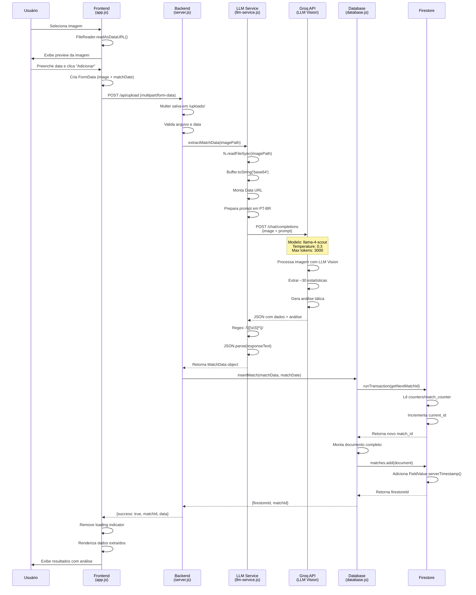
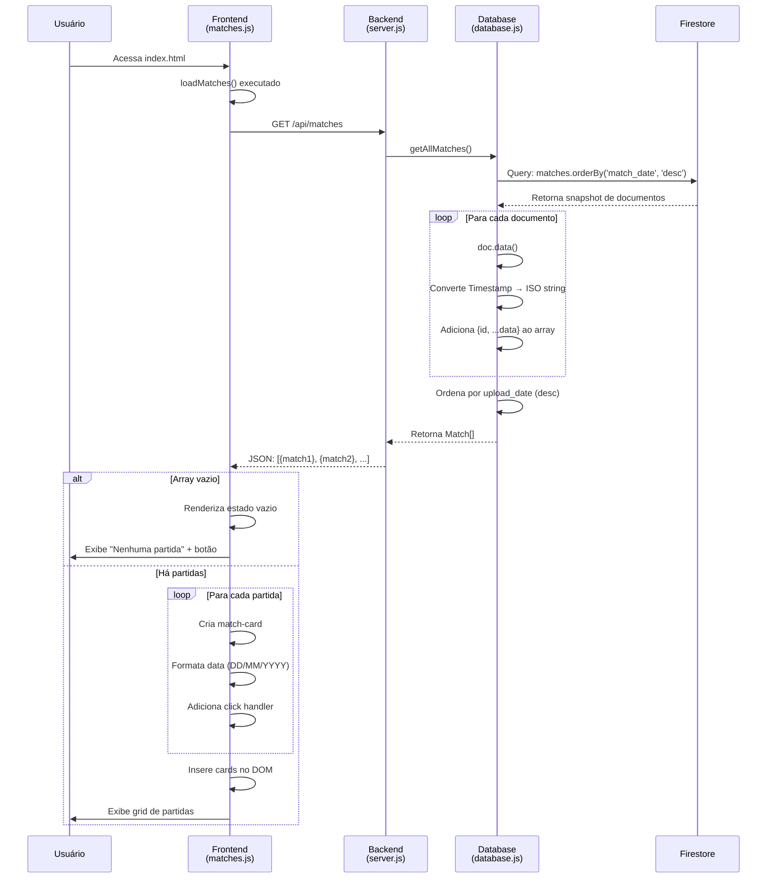
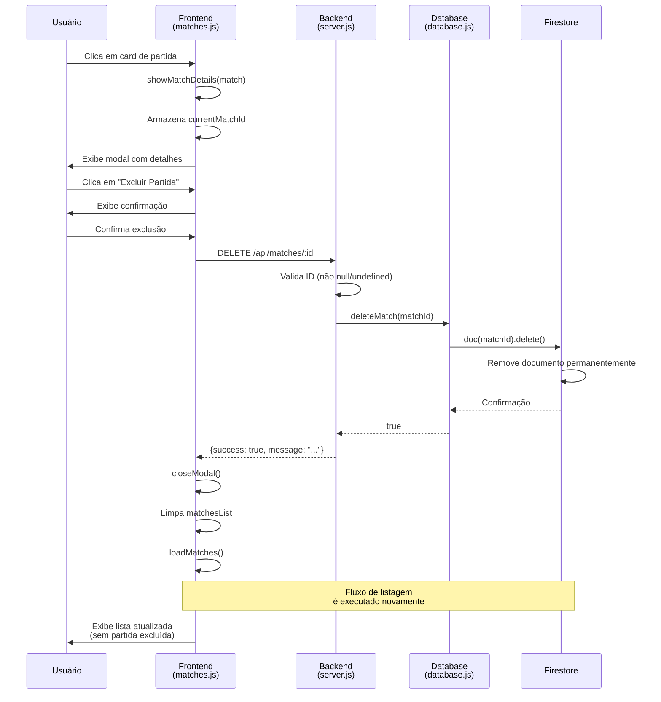
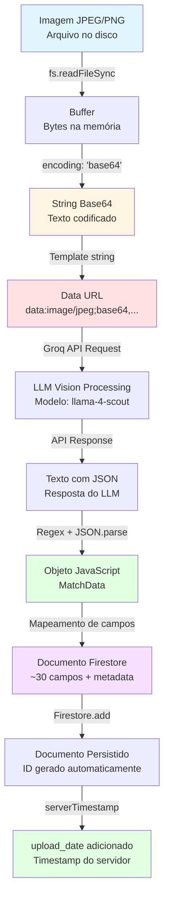
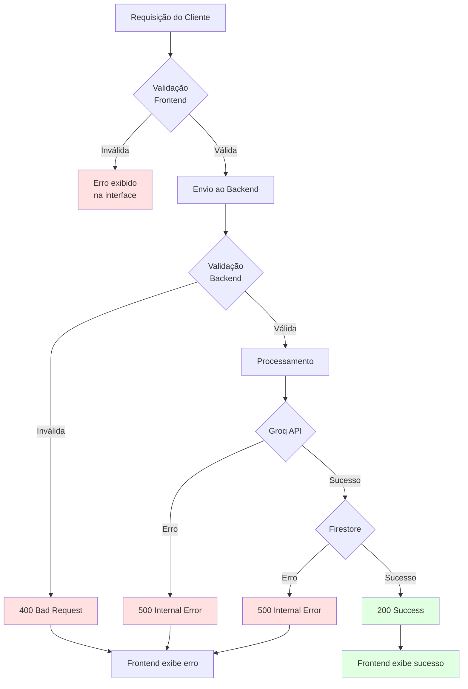

# Fluxo de Dados - JHD Managers

> Última atualização: Janeiro 2025

## Visão Geral

Este documento detalha o fluxo completo de dados no sistema JHD Managers, desde o upload de imagens de partidas até a visualização dos dados processados. O sistema processa imagens usando IA (Groq LLM Vision), armazena dados estruturados no Firebase Firestore e apresenta análises detalhadas através de uma interface web responsiva.

## Índice

1. [Fluxo de Upload Completo](#fluxo-de-upload-completo)
2. [Fluxo de Listagem de Partidas](#fluxo-de-listagem-de-partidas)
3. [Fluxo de Exclusão de Partidas](#fluxo-de-exclusão-de-partidas)
4. [Transformações de Dados](#transformações-de-dados)
5. [Arquitetura de Componentes](#arquitetura-de-componentes)
6. [Tratamento de Erros](#tratamento-de-erros)

---

## Fluxo de Upload Completo

### Descrição Textual

O fluxo de upload é o processo mais complexo do sistema, envolvendo múltiplas transformações de dados e integrações com serviços externos:

**1. Seleção e Preview da Imagem (Frontend)**
- Usuário acessa `add_partida.html` e seleciona uma imagem (JPEG/PNG)
- JavaScript (`app.js`) usa FileReader API para criar preview local
- Imagem é convertida para Data URL (base64) apenas para visualização
- Nenhum dado é enviado ao servidor nesta etapa

**2. Submissão do Formulário (Frontend → Backend)**
- Usuário preenche a data da partida (formato YYYY-MM-DD)
- Ao clicar em "Adicionar Partida", FormData é criado com:
  - `image`: Arquivo binário da imagem
  - `matchDate`: String com a data da partida
- Requisição POST é enviada para `/api/upload` via fetch API
- Interface exibe indicador de carregamento

**3. Recebimento e Validação (Backend)**
- Express recebe a requisição através do middleware Multer
- Multer salva temporariamente a imagem em `/uploads/`
- Backend valida presença do arquivo e data
- Se inválido, retorna erro 400


**4. Extração de Dados via IA (Backend → Groq API)**
- Backend chama `extractMatchData(imagePath)` do `llm-service.js`
- Serviço lê o arquivo de imagem do disco usando `fs.readFileSync()`
- Imagem é convertida para base64 encoding
- Base64 é encapsulado em Data URL: `data:image/jpeg;base64,{base64}`
- Prompt em português brasileiro é montado com instruções detalhadas
- Requisição é enviada para Groq API com:
  - Modelo: `meta-llama/llama-4-scout-17b-16e-instruct`
  - Temperature: 0.3 (baixa variabilidade para maior precisão)
  - Max tokens: 3000
  - Conteúdo: Prompt + Data URL da imagem
- Groq processa a imagem e extrai ~30 estatísticas
- Resposta contém JSON com todos os dados extraídos + análise tática

**5. Processamento da Resposta da IA (Backend)**
- Backend recebe resposta da Groq API
- Usa regex para extrair JSON da resposta: `/\{[\s\S]*\}/`
- JSON é parseado para objeto JavaScript
- Objeto contém todos os campos de estatísticas + análise textual

**6. Geração de ID Incremental (Backend → Firestore)**
- Backend chama `insertMatch(matchData, matchDate)` do `database.js`
- Database chama `getNextMatchId()` para obter próximo ID
- Firestore Transaction é executada:
  - Lê documento `counters/match_counter`
  - Se não existe, cria com `current_id: 1`
  - Se existe, incrementa `current_id` em 1
  - Retorna novo ID de forma atômica (thread-safe)

**7. Persistência no Firestore (Backend → Firestore)**
- Documento é montado com todos os campos:
  - `match_id`: ID incremental gerado
  - `match_date`: Data fornecida pelo usuário
  - `upload_date`: Timestamp do servidor (FieldValue.serverTimestamp())
  - ~30 campos de estatísticas extraídas
  - `match_analysis`: Análise tática gerada pela IA
  - `raw_data`: JSON stringificado com dados originais
- Documento é adicionado à collection `matches`
- Firestore retorna ID do documento (firestoreId)

**8. Resposta ao Cliente (Backend → Frontend)**
- Backend retorna JSON com:
  - `success: true`
  - `matchId`: ID incremental da partida
  - `firestoreId`: ID do documento no Firestore
  - `data`: Objeto completo com todos os dados extraídos
- Status HTTP 200

**9. Exibição dos Resultados (Frontend)**
- Frontend recebe resposta e remove indicador de carregamento
- Dados são renderizados dinamicamente na página:
  - ID da partida destacado
  - Placar (times e gols)
  - Estatísticas principais (chutes, posse, etc.)
  - Análise tática completa
- Usuário pode revisar os dados antes de navegar


### Diagrama de Sequência - Upload Completo




---

## Fluxo de Listagem de Partidas

### Descrição Textual

O fluxo de listagem carrega todas as partidas armazenadas e as exibe em formato de cards:

**1. Carregamento da Página (Frontend)**
- Usuário acessa `index.html`
- JavaScript (`matches.js`) executa automaticamente `loadMatches()`
- Função é chamada no carregamento da página

**2. Requisição ao Backend (Frontend → Backend)**
- Frontend faz requisição GET para `/api/matches`
- Nenhum parâmetro é necessário
- Requisição é simples e sem corpo

**3. Query no Firestore (Backend → Firestore)**
- Backend chama `getAllMatches()` do `database.js`
- Database executa query no Firestore:
  - Collection: `matches`
  - Ordenação: `orderBy('match_date', 'desc')`
  - Sem filtros (retorna todas as partidas)
- Firestore retorna snapshot com todos os documentos

**4. Processamento dos Dados (Backend)**
- Backend itera sobre cada documento do snapshot
- Para cada documento:
  - Extrai dados com `doc.data()`
  - Converte Timestamp do Firestore para ISO string
  - Adiciona `id` do documento ao objeto
  - Adiciona à lista de partidas
- Lista é ordenada novamente por `upload_date` (mais recente primeiro)
- Ordenação dupla garante que partidas do mesmo dia apareçam por ordem de upload

**5. Resposta ao Cliente (Backend → Frontend)**
- Backend retorna array de objetos Match
- Cada objeto contém todos os campos da partida
- Status HTTP 200

**6. Renderização na Interface (Frontend)**
- Frontend recebe array de partidas
- Se array vazio, exibe estado vazio com botão para adicionar
- Se há partidas, cria grid de cards:
  - Para cada partida, cria um card com:
    - Data da partida formatada (DD/MM/YYYY)
    - Times e placar
    - Estatísticas principais (chutes, posse)
    - Click handler para abrir modal de detalhes
- Cards são inseridos no DOM


### Diagrama de Sequência - Listagem de Partidas



---

## Fluxo de Exclusão de Partidas

### Descrição Textual

O fluxo de exclusão permite remover partidas do sistema de forma segura:

**1. Abertura do Modal de Detalhes (Frontend)**
- Usuário clica em um card de partida
- Frontend chama `showMatchDetails(match)`
- Modal é exibido com todas as estatísticas
- ID da partida é armazenado em `currentMatchId`

**2. Solicitação de Exclusão (Frontend)**
- Usuário clica no botão "Excluir Partida"
- Frontend chama `deleteMatch()`
- Dialog de confirmação é exibido: "Tem certeza?"
- Se usuário cancela, processo é interrompido

**3. Requisição de Exclusão (Frontend → Backend)**
- Frontend faz requisição DELETE para `/api/matches/:id`
- ID é o Firestore document ID (não o match_id incremental)
- Requisição não tem corpo

**4. Validação e Exclusão (Backend → Firestore)**
- Backend valida que ID não é undefined/null
- Backend chama `deleteMatch(matchId)` do `database.js`
- Database executa `matchesCollection.doc(id).delete()`
- Firestore remove o documento permanentemente
- Operação é atômica e imediata


**5. Resposta e Atualização (Backend → Frontend)**
- Backend retorna `{success: true, message: "Partida excluída"}`
- Status HTTP 200

**6. Atualização da Interface (Frontend)**
- Frontend fecha o modal
- Frontend limpa a lista de partidas
- Frontend chama `loadMatches()` novamente
- Lista atualizada é exibida sem a partida excluída
- Usuário vê confirmação visual da exclusão

> ⚠️ **Importante:** A exclusão é permanente e não pode ser desfeita. O sistema não mantém histórico de partidas excluídas.

### Diagrama de Sequência - Exclusão de Partidas




---

## Transformações de Dados

### Visão Geral das Transformações

Os dados passam por múltiplas transformações desde a imagem original até o armazenamento final:

```
Imagem JPEG/PNG → Buffer → Base64 → Data URL → JSON → Firestore Document
```

### Detalhamento de Cada Transformação

#### 1. Imagem Original → Buffer

**Localização:** `llm-service.js` - função `extractMatchData()`

**Processo:**
```javascript
const imageBuffer = fs.readFileSync(imagePath);
```

**Entrada:** Arquivo de imagem no disco (`uploads/abc123.jpg`)

**Saída:** Buffer do Node.js contendo bytes da imagem

**Propósito:** Carregar imagem na memória para processamento

---

#### 2. Buffer → Base64

**Localização:** `llm-service.js` - função `extractMatchData()`

**Processo:**
```javascript
const imageBase64 = fs.readFileSync(imagePath, { encoding: 'base64' });
```

**Entrada:** Buffer com bytes da imagem

**Saída:** String base64 (ex: `iVBORw0KGgoAAAANSUhEUgAA...`)

**Propósito:** Converter binário para formato texto que pode ser transmitido via JSON

**Exemplo:**
```
Buffer: <Buffer 89 50 4e 47 0d 0a 1a 0a ...>
Base64: "iVBORw0KGgoAAAANSUhEUgAAAAUA..."
```

---

#### 3. Base64 → Data URL

**Localização:** `llm-service.js` - função `extractMatchData()`

**Processo:**
```javascript
const imageUrl = `data:image/jpeg;base64,${imageBase64}`;
```

**Entrada:** String base64

**Saída:** Data URL completa

**Propósito:** Formato aceito pela Groq API para envio de imagens

**Exemplo:**
```
Base64: "iVBORw0KGgoAAAANSUhEUgAAAAUA..."
Data URL: "data:image/jpeg;base64,iVBORw0KGgoAAAANSUhEUgAAAAUA..."
```

---

#### 4. Data URL → Requisição Groq API

**Localização:** `llm-service.js` - função `extractMatchData()`

**Processo:**
```javascript
const completion = await groq.chat.completions.create({
  model: "meta-llama/llama-4-scout-17b-16e-instruct",
  messages: [
    {
      role: "user",
      content: [
        { type: "text", text: prompt },
        { type: "image_url", image_url: { url: imageUrl } }
      ]
    }
  ],
  temperature: 0.3,
  max_tokens: 3000
});
```

**Entrada:** Data URL + Prompt em português

**Saída:** Resposta da API com JSON embutido

**Propósito:** Enviar imagem para processamento por LLM Vision


---

#### 5. Resposta Groq → JSON Extraído

**Localização:** `llm-service.js` - função `extractMatchData()`

**Processo:**
```javascript
const responseText = completion.choices[0].message.content;
const jsonMatch = responseText.match(/\{[\s\S]*\}/);
const matchData = JSON.parse(jsonMatch[0]);
```

**Entrada:** Texto da resposta (pode conter texto adicional)

**Saída:** Objeto JavaScript com dados estruturados

**Propósito:** Extrair e parsear JSON da resposta do LLM

**Exemplo de Resposta Groq:**
```
Aqui estão os dados extraídos da imagem:

{
  "home_team": "Manchester City",
  "away_team": "Liverpool",
  "home_score": 2,
  "away_score": 1,
  "home_shots": 15,
  ...
}
```

**Após Extração:**
```javascript
{
  home_team: "Manchester City",
  away_team: "Liverpool",
  home_score: 2,
  away_score: 1,
  home_shots: 15,
  // ... ~30 campos
  match_analysis: "O Manchester City dominou..."
}
```

---

#### 6. JSON → Firestore Document

**Localização:** `database.js` - função `insertMatch()`

**Processo:**
```javascript
const newMatch = {
  match_id: matchId,                    // ID incremental
  match_date: matchDate,                // Data fornecida
  upload_date: FieldValue.serverTimestamp(), // Timestamp do servidor
  home_team: matchData.home_team || '',
  away_team: matchData.away_team || '',
  home_score: matchData.home_score || 0,
  // ... todos os ~30 campos
  match_analysis: matchData.match_analysis || '',
  raw_data: JSON.stringify(matchData)   // JSON original preservado
};

await matchesCollection.add(newMatch);
```

**Entrada:** Objeto JavaScript com dados extraídos

**Saída:** Documento Firestore com todos os campos

**Propósito:** Persistir dados de forma estruturada no banco de dados

**Transformações Aplicadas:**
- Adiciona `match_id` incremental
- Adiciona `match_date` fornecida pelo usuário
- Adiciona `upload_date` com timestamp do servidor
- Converte valores null/undefined para defaults (0, '')
- Stringifica objeto original em `raw_data` para preservação


---

### Diagrama de Transformações



### Exemplo Completo de Transformação

#### Entrada Original
```
Arquivo: uploads/1234567890.jpg
Tamanho: 245 KB
Formato: JPEG
```

#### Após Base64
```
String: "iVBORw0KGgoAAAANSUhEUgAAAAUA..." (muito longa)
Tamanho: ~327 KB (33% maior que original)
```

#### Após Data URL
```
URL: "data:image/jpeg;base64,iVBORw0KGgoAAAANSUhEUgAAAAUA..."
Uso: Enviado no corpo da requisição JSON para Groq
```

#### Resposta da Groq API
```json
{
  "home_team": "Manchester City",
  "away_team": "Liverpool",
  "home_score": 2,
  "away_score": 1,
  "home_shots": 15,
  "away_shots": 8,
  "home_possession": 62,
  "away_possession": 38,
  "shot_accuracy_home": 67,
  "shot_accuracy_away": 50,
  "pass_accuracy_home": 89,
  "pass_accuracy_away": 82,
  "dribbles_completed_rate_home": 75,
  "dribbles_completed_rate_away": 60,
  "expected_goals_home": 2.3,
  "expected_goals_away": 0.8,
  "passes_home": 542,
  "passes_away": 318,
  "duels_won_home": 28,
  "duels_won_away": 22,
  "duels_lost_home": 18,
  "duels_lost_away": 24,
  "interceptions_home": 12,
  "interceptions_away": 15,
  "blocks_home": 5,
  "blocks_away": 8,
  "ball_recovery_time": 8,
  "fouls_committed_home": 10,
  "fouls_committed_away": 14,
  "fouls_home": 14,
  "fouls_away": 10,
  "offsides_home": 2,
  "offsides_away": 4,
  "corners_home": 7,
  "corners_away": 3,
  "penalties_home": 0,
  "penalties_away": 0,
  "yellow_cards_home": 2,
  "yellow_cards_away": 3,
  "match_analysis": "O Manchester City dominou a partida com 62% de posse..."
}
```


#### Documento Final no Firestore
```json
{
  "match_id": 42,
  "match_date": "2024-01-15",
  "upload_date": "2024-01-15T18:30:00.000Z",
  "home_team": "Manchester City",
  "away_team": "Liverpool",
  "home_score": 2,
  "away_score": 1,
  "home_shots": 15,
  "away_shots": 8,
  "home_possession": 62,
  "away_possession": 38,
  "shot_accuracy_home": 67,
  "shot_accuracy_away": 50,
  "pass_accuracy_home": 89,
  "pass_accuracy_away": 82,
  "dribbles_completed_rate_home": 75,
  "dribbles_completed_rate_away": 60,
  "expected_goals_home": 2.3,
  "expected_goals_away": 0.8,
  "passes_home": 542,
  "passes_away": 318,
  "duels_won_home": 28,
  "duels_won_away": 22,
  "duels_lost_home": 18,
  "duels_lost_away": 24,
  "interceptions_home": 12,
  "interceptions_away": 15,
  "blocks_home": 5,
  "blocks_away": 8,
  "ball_recovery_time": 8,
  "fouls_committed_home": 10,
  "fouls_committed_away": 14,
  "fouls_home": 14,
  "fouls_away": 10,
  "offsides_home": 2,
  "offsides_away": 4,
  "corners_home": 7,
  "corners_away": 3,
  "penalties_home": 0,
  "penalties_away": 0,
  "yellow_cards_home": 2,
  "yellow_cards_away": 3,
  "match_analysis": "O Manchester City dominou a partida com 62% de posse de bola e 542 passes completados, demonstrando seu estilo de jogo característico. A eficiência ofensiva foi superior, com 15 chutes e xG de 2.3, refletindo a qualidade das chances criadas. O Liverpool, apesar da menor posse, mostrou solidez defensiva com 15 interceptações e 8 bloqueios. A diferença no meio-campo foi decisiva, com o City vencendo mais duelos (28 vs 22) e mantendo maior precisão nos passes (89% vs 82%). A disciplina foi um ponto de atenção para ambos os times, com 24 faltas cometidas no total. O resultado justo reflete a superioridade técnica e tática do Manchester City nesta partida virtual do EA FC 26.",
  "raw_data": "{\"home_team\":\"Manchester City\",\"away_team\":\"Liverpool\",...}"
}
```

> 💡 **Nota:** O campo `raw_data` preserva o JSON original da extração para fins de debug e auditoria.


---

## Arquitetura de Componentes

### Diagrama de Componentes e Fluxo de Dados

```mermaid
graph TB
    subgraph Frontend["Frontend (Cliente Web)"]
        A[index.html<br/>Listagem de Partidas]
        B[add_partida.html<br/>Upload de Imagens]
        C[app.js<br/>Lógica de Upload]
        D[matches.js<br/>Listagem e Modal]
        E[nav.js<br/>Navegação]
    end
    
    subgraph Backend["Backend (Node.js + Express)"]
        F[server.js<br/>Rotas REST]
        G[database.js<br/>Camada de Dados]
        H[llm-service.js<br/>Integração IA]
    end
    
    subgraph External["Serviços Externos"]
        I[Groq API<br/>LLM Vision]
        J[Firebase Firestore<br/>Banco de Dados NoSQL]
    end
    
    subgraph Storage["Armazenamento Temporário"]
        K[/uploads/<br/>Imagens Temporárias]
    end
    
    B -->|FormData| F
    A -->|GET /api/matches| F
    D -->|DELETE /api/matches/:id| F
    C -->|POST /api/upload| F
    
    F -->|Multer| K
    F -->|extractMatchData| H
    F -->|CRUD operations| G
    
    H -->|readFileSync| K
    H -->|Chat Completions| I
    
    G -->|Firebase Admin SDK| J
    
    I -->|JSON Response| H
    J -->|Documents| G
    
    G -->|Match Data| F
    F -->|JSON Response| A
    F -->|JSON Response| B
    
    style Frontend fill:#e1f5ff
    style Backend fill:#fff4e1
    style External fill:#ffe1e1
    style Storage fill:#f5f5f5
```

### Descrição dos Componentes

#### Frontend Components

**1. index.html + matches.js**
- **Responsabilidade:** Exibir lista de partidas e modal de detalhes
- **Entrada:** Array de partidas via GET /api/matches
- **Saída:** Interface visual com cards e modal
- **Funcionalidades:**
  - Carregamento automático de partidas
  - Renderização de cards com estatísticas
  - Modal com detalhes completos
  - Botão de exclusão com confirmação

**2. add_partida.html + app.js**
- **Responsabilidade:** Upload de imagens e exibição de resultados
- **Entrada:** Arquivo de imagem + data da partida
- **Saída:** FormData via POST /api/upload
- **Funcionalidades:**
  - Preview de imagem antes do upload
  - Validação de formato (JPEG/PNG)
  - Indicador de carregamento
  - Exibição de dados extraídos

**3. nav.js**
- **Responsabilidade:** Navegação responsiva
- **Funcionalidades:**
  - Menu hamburger para mobile
  - Destaque da página ativa
  - Toggle de menu


#### Backend Components

**1. server.js**
- **Responsabilidade:** Servidor HTTP e roteamento
- **Rotas Expostas:**
  - `POST /api/upload` - Upload e processamento
  - `GET /api/matches` - Listar partidas
  - `DELETE /api/matches/:id` - Excluir partida
  - `GET /` - Servir arquivos estáticos
- **Middleware:**
  - `express.json()` - Parse de JSON
  - `express.static('public')` - Arquivos estáticos
  - `multer({ dest: 'uploads/' })` - Upload de arquivos
- **Porta:** 3000 (padrão) ou PORT do ambiente

**2. database.js**
- **Responsabilidade:** Camada de acesso ao Firestore
- **Funções Expostas:**
  - `insertMatch(matchData, matchDate)` - Inserir partida
  - `getAllMatches()` - Listar todas as partidas
  - `getMatchById(id)` - Obter partida específica
  - `deleteMatch(matchId)` - Excluir partida
  - `getNextMatchId()` - Gerar ID incremental (interno)
- **Inicialização:**
  - Carrega credenciais do Firebase
  - Inicializa Firebase Admin SDK
  - Conecta ao Firestore

**3. llm-service.js**
- **Responsabilidade:** Integração com Groq API
- **Função Exposta:**
  - `extractMatchData(imagePath)` - Extrair dados da imagem
- **Processo:**
  - Lê imagem do disco
  - Converte para base64
  - Monta prompt em português
  - Envia para Groq API
  - Extrai e parseia JSON da resposta
- **Configuração:**
  - Modelo: `meta-llama/llama-4-scout-17b-16e-instruct`
  - Temperature: 0.3
  - Max tokens: 3000

#### External Services

**1. Groq API**
- **Serviço:** LLM Vision para extração de dados
- **Endpoint:** `https://api.groq.com/openai/v1/chat/completions`
- **Autenticação:** API Key via header
- **Entrada:** Imagem (Data URL) + Prompt
- **Saída:** JSON com ~30 estatísticas + análise

**2. Firebase Firestore**
- **Serviço:** Banco de dados NoSQL
- **Collections:**
  - `matches` - Documentos de partidas
  - `counters` - Controle de IDs incrementais
- **Operações:**
  - `add()` - Adicionar documento
  - `get()` - Consultar documentos
  - `delete()` - Remover documento
  - `runTransaction()` - Transações atômicas

#### Temporary Storage

**uploads/**
- **Propósito:** Armazenamento temporário de imagens
- **Gerenciamento:** Multer cria arquivos com nomes únicos
- **Limpeza:** Manual (não há limpeza automática implementada)
- **Formato:** Arquivos sem extensão (ex: `1234567890`)

> ⚠️ **Nota:** Em produção, considere implementar limpeza automática de arquivos antigos em `/uploads/` para evitar acúmulo de espaço.


---

## Tratamento de Erros

### Estratégia de Tratamento de Erros

O sistema implementa tratamento de erros em múltiplas camadas para garantir resiliência e feedback adequado ao usuário.

### Erros no Frontend

#### 1. Erro de Validação de Upload

**Cenário:** Usuário tenta fazer upload sem selecionar imagem

**Tratamento:**
```javascript
if (!file) {
  // Validação no cliente antes de enviar
  return;
}
```

**Feedback:** Botão de submit desabilitado até que imagem seja selecionada

---

#### 2. Erro de Rede

**Cenário:** Falha na comunicação com o backend

**Tratamento:**
```javascript
try {
  const response = await fetch('/api/upload', { ... });
  const data = await response.json();
} catch (error) {
  result.innerHTML = `<p style="color: red;">❌ Erro: ${error.message}</p>`;
}
```

**Feedback:** Mensagem de erro exibida na interface

---

#### 3. Erro de Carregamento de Partidas

**Cenário:** Falha ao carregar lista de partidas

**Tratamento:**
```javascript
catch (error) {
  matchesList.innerHTML = `
    <div class="empty-state">
      <div class="empty-state-icon">❌</div>
      <div class="empty-state-text">Erro ao carregar partidas</div>
    </div>
  `;
}
```

**Feedback:** Estado de erro visual com ícone

---

### Erros no Backend

#### 1. Erro de Upload sem Imagem

**Cenário:** Requisição POST sem arquivo

**Tratamento:**
```javascript
if (!req.file) {
  return res.status(400).json({ error: 'Nenhuma imagem enviada' });
}
```

**Status HTTP:** 400 Bad Request

**Resposta:**
```json
{
  "error": "Nenhuma imagem enviada"
}
```

---

#### 2. Erro na Extração de Dados (Groq API)

**Cenário:** Falha na comunicação com Groq ou erro no processamento

**Tratamento:**
```javascript
try {
  const matchData = await extractMatchData(imagePath);
} catch (error) {
  console.error('Erro:', error);
  res.status(500).json({ error: error.message });
}
```

**Status HTTP:** 500 Internal Server Error

**Resposta:**
```json
{
  "error": "Erro na extração: GROQ_API_KEY não configurada"
}
```

**Possíveis Causas:**
- API Key não configurada
- Limite de rate da API excedido
- Imagem em formato não suportado
- Timeout na requisição


---

#### 3. Erro de Conexão com Firestore

**Cenário:** Falha ao conectar ou operar no Firestore

**Tratamento:**
```javascript
try {
  const serviceAccount = JSON.parse(readFileSync(serviceAccountPath, 'utf8'));
  admin.initializeApp({ credential: admin.credential.cert(serviceAccount) });
} catch (error) {
  console.error('✗ Erro ao conectar ao Firestore:', error.message);
  process.exit(1);
}
```

**Comportamento:** Servidor não inicia se Firestore não conectar

**Possíveis Causas:**
- Arquivo `firebase-credentials.json` não encontrado
- Credenciais inválidas
- Problemas de rede
- Projeto Firebase não configurado

---

#### 4. Erro de ID Inválido na Exclusão

**Cenário:** Tentativa de excluir partida com ID inválido

**Tratamento:**
```javascript
if (!matchId || matchId === 'undefined' || matchId === 'null') {
  return res.status(400).json({ error: 'ID da partida inválido' });
}
```

**Status HTTP:** 400 Bad Request

**Resposta:**
```json
{
  "error": "ID da partida inválido"
}
```

---

### Erros no LLM Service

#### 1. Erro de API Key Não Configurada

**Cenário:** GROQ_API_KEY não está no .env

**Tratamento:**
```javascript
if (!process.env.GROQ_API_KEY) {
  throw new Error('GROQ_API_KEY não configurada no arquivo .env');
}
```

**Propagação:** Erro é capturado no backend e retornado ao cliente

---

#### 2. Erro de Parsing de JSON

**Cenário:** Resposta da Groq não contém JSON válido

**Tratamento:**
```javascript
const jsonMatch = responseText.match(/\{[\s\S]*\}/);

if (jsonMatch) {
  return JSON.parse(jsonMatch[0]);
}

throw new Error('Não foi possível extrair JSON da resposta');
```

**Propagação:** Erro é capturado no backend

**Possíveis Causas:**
- LLM retornou resposta em formato inesperado
- Imagem não contém dados de partida
- Prompt não foi seguido corretamente

---

### Erros no Database Layer

#### 1. Erro ao Gerar ID Incremental

**Cenário:** Falha na transação do Firestore

**Tratamento:**
```javascript
try {
  const result = await db.runTransaction(async (transaction) => {
    // ... lógica de transação
  });
  return result;
} catch (error) {
  console.error('Erro ao obter próximo ID:', error);
  throw new Error('Erro ao gerar ID da partida');
}
```

**Propagação:** Erro é capturado no backend

---

#### 2. Erro ao Inserir Documento

**Cenário:** Falha ao adicionar documento no Firestore

**Tratamento:**
```javascript
try {
  const docRef = await matchesCollection.add(newMatch);
  return { firestoreId: docRef.id, matchId: matchId };
} catch (error) {
  console.error('Erro ao inserir partida:', error);
  throw error;
}
```

**Propagação:** Erro é capturado no backend e retornado ao cliente


---

### Diagrama de Fluxo de Erros



### Boas Práticas de Tratamento de Erros

#### 1. Logging Adequado

**Backend:**
```javascript
console.error('Erro ao inserir partida:', error);
console.log('Partida salva com sucesso. Firestore ID:', docRef.id);
```

**Propósito:** Facilitar debugging e monitoramento

---

#### 2. Mensagens de Erro Claras

**Evitar:**
```javascript
{ error: "Error" }
```

**Preferir:**
```javascript
{ error: "GROQ_API_KEY não configurada no arquivo .env" }
```

**Propósito:** Facilitar resolução de problemas pelo usuário

---

#### 3. Códigos HTTP Apropriados

- **200:** Sucesso
- **400:** Erro de validação (cliente)
- **500:** Erro interno (servidor)

**Propósito:** Seguir padrões REST

---

#### 4. Não Expor Informações Sensíveis

**Evitar:**
```javascript
{ error: error.stack } // Expõe estrutura interna
```

**Preferir:**
```javascript
{ error: error.message } // Mensagem genérica
```

**Propósito:** Segurança

---

#### 5. Validação em Múltiplas Camadas

- **Frontend:** Validação básica (UX)
- **Backend:** Validação completa (segurança)
- **Database:** Constraints e validações

**Propósito:** Defesa em profundidade

---

## Referências

### Documentos Relacionados

- [Visão Geral da Arquitetura](overview.md) - Arquitetura completa do sistema
- [API Endpoints](../api/endpoints.md) - Documentação detalhada de cada endpoint
- [Schema do Banco de Dados](../database/schema.md) - Estrutura completa do Firestore
- [Serviço de IA (LLM)](../services/llm-service.md) - Detalhes da integração com Groq
- [Frontend](../services/frontend.md) - Documentação do cliente web

### Recursos Externos

- [Groq API Documentation](https://console.groq.com/docs) - Documentação oficial da Groq
- [Firebase Firestore Documentation](https://firebase.google.com/docs/firestore) - Documentação do Firestore
- [Express.js Documentation](https://expressjs.com/) - Documentação do Express
- [Multer Documentation](https://github.com/expressjs/multer) - Middleware de upload

---

## Próximos Passos

Após entender o fluxo de dados, recomendamos:

1. **Para Desenvolvedores:** Ler [Guia de Configuração do Ambiente](../guides/development-setup.md)
2. **Para DevOps:** Consultar [Guia de Deploy](../guides/deployment.md)
3. **Para Troubleshooting:** Ver [Guia de Resolução de Problemas](../guides/troubleshooting.md)
4. **Para Segurança:** Revisar [Boas Práticas de Segurança](../security/best-practices.md)

---

> 📝 **Nota:** Este documento é mantido em sincronia com o código. Se encontrar discrepâncias, por favor reporte via issue no repositório.

