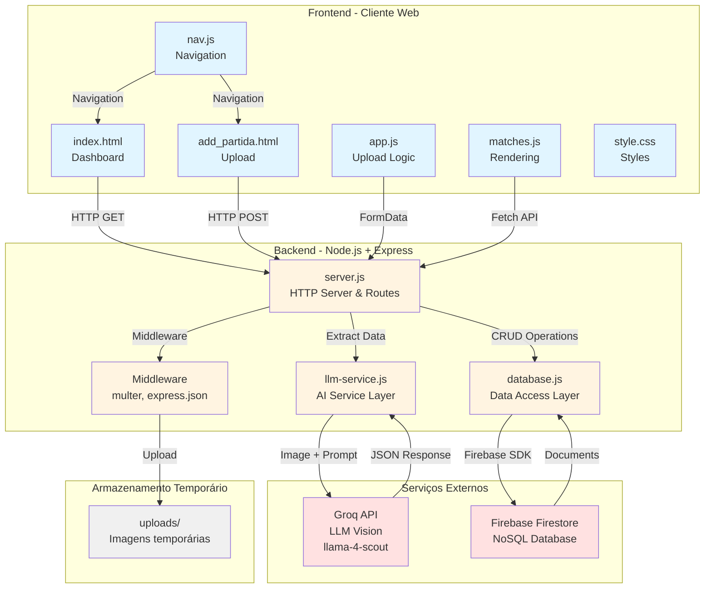

# Visão Geral da Arquitetura

> Última atualização: Janeiro 2025

## Introdução

O JHD Managers é um sistema de análise automática de partidas do EA FC 26 que utiliza inteligência artificial para extrair dados de imagens de resumo de partidas e gerar análises táticas detalhadas. O sistema permite aos usuários fazer upload de screenshots do jogo, processar automaticamente as estatísticas visíveis, armazenar os dados em banco de dados NoSQL e visualizar histórico completo com dashboard de estatísticas.

Este documento descreve a arquitetura completa do sistema, incluindo stack tecnológica, componentes principais, padrões arquiteturais e decisões de design.

## Stack Tecnológica Completa

### Backend

- **Node.js 18+**: Runtime JavaScript para execução do servidor
  - Escolhido por sua performance, ecossistema rico e suporte nativo a ES Modules
  - Versão 18+ garante suporte a recursos modernos e estabilidade LTS

- **Express.js 4.x**: Framework web minimalista e flexível
  - Roteamento simples e eficiente para API REST
  - Middleware ecosystem robusto (multer, static files)
  - Baixa curva de aprendizado e alta produtividade

- **Multer 1.4.x**: Middleware para upload de arquivos multipart/form-data
  - Gerenciamento automático de uploads de imagens
  - Armazenamento temporário em disco antes do processamento
  - Validação de tipos de arquivo

- **Firebase Admin SDK 13.x**: SDK oficial para integração com Firebase
  - Acesso completo ao Firestore (banco de dados NoSQL)
  - Autenticação via service account (credenciais JSON)
  - Suporte a transações atômicas para IDs incrementais

- **Groq SDK 0.7.x**: Cliente JavaScript para Groq API
  - Integração com modelos LLM de alta performance
  - Suporte a Vision Models para análise de imagens
  - API simples e bem documentada

- **dotenv 16.x**: Gerenciamento de variáveis de ambiente
  - Carregamento automático de arquivo .env
  - Separação de configurações sensíveis do código

### Frontend

- **HTML5**: Estrutura semântica das páginas
  - Formulários para upload de imagens
  - Estrutura de cards para listagem de partidas
  - Modal para exibição de detalhes

- **CSS3**: Estilização responsiva e moderna
  - Flexbox e Grid para layouts responsivos
  - Media queries para adaptação mobile
  - Variáveis CSS para temas consistentes
  - Animações e transições suaves

- **JavaScript Vanilla (ES6+)**: Lógica do cliente sem frameworks
  - Fetch API para comunicação com backend
  - DOM manipulation para renderização dinâmica
  - Event listeners para interatividade
  - FormData para uploads de arquivos
  - Decisão de não usar frameworks: simplicidade, performance e baixa complexidade do frontend

### Serviços Externos

- **Groq API**: Plataforma de inferência de LLM de alta velocidade
  - Modelo: meta-llama/llama-4-scout-17b-16e-instruct
  - Capacidade de Vision (análise de imagens)
  - Extração de dados estruturados de screenshots
  - Geração de análises táticas em português brasileiro

- **Firebase Firestore**: Banco de dados NoSQL em nuvem
  - Armazenamento de documentos JSON flexíveis
  - Queries com ordenação e filtros
  - Timestamps automáticos do servidor
  - Escalabilidade automática
  - Backup e recuperação gerenciados pelo Google

### Ferramentas de Desenvolvimento

- **npm**: Gerenciador de pacotes e scripts
- **Git**: Controle de versão
- **ES Modules**: Sistema de módulos nativo do Node.js

## Componentes Principais

### 1. Frontend (Cliente Web)

**Responsabilidades:**
- Fornecer interface de usuário responsiva (desktop e mobile)
- Capturar uploads de imagens de partidas
- Exibir preview de imagens antes do upload
- Renderizar listagem de partidas com cards visuais
- Exibir modal com estatísticas detalhadas e análise tática
- Gerenciar navegação entre páginas
- Fornecer feedback visual de operações (loading, sucesso, erro)

**Arquivos Principais:**
- `public/index.html` - Página principal com listagem de partidas
- `public/add_partida.html` - Formulário de upload de imagens
- `public/app.js` - Lógica de upload e preview de imagens
- `public/matches.js` - Renderização de partidas e modal de detalhes
- `public/nav.js` - Navegação responsiva (hamburger menu)
- `public/style.css` - Estilos globais e responsivos

**Características:**
- SPA (Single Page Application) com múltiplas páginas HTML
- Comunicação assíncrona com backend via Fetch API
- Renderização dinâmica de dados sem recarregamento de página
- Design responsivo com breakpoints para mobile/tablet/desktop
- Sem dependências de frameworks JavaScript (Vanilla JS)

### 2. Backend (Servidor API)

**Responsabilidades:**
- Servir arquivos estáticos do frontend
- Processar uploads de imagens via multipart/form-data
- Orquestrar extração de dados via LLM Service
- Gerenciar operações CRUD no Firestore
- Validar dados de entrada
- Tratamento centralizado de erros
- Logging de operações e erros

**Arquivos Principais:**
- `server.js` - Configuração do Express, rotas e middlewares
- `database.js` - Camada de acesso ao Firestore (Data Access Layer)
- `llm-service.js` - Integração com Groq API (Service Layer)

**Endpoints REST:**
- `POST /api/upload` - Upload e processamento de partida
- `GET /api/matches` - Listar todas as partidas
- `DELETE /api/matches/:id` - Excluir partida específica

**Características:**
- Arquitetura em camadas (Routes → Services → Data Access)
- Stateless (sem sessões, todas as informações no Firestore)
- Middleware pipeline (JSON parsing → Upload → Static files)
- Error handling com try-catch e status codes HTTP apropriados

### 3. Serviço de IA (LLM Vision)

**Responsabilidades:**
- Converter imagens JPEG/PNG para formato base64
- Construir prompt em português brasileiro para extração de dados
- Enviar imagens e prompt para Groq API
- Extrair aproximadamente 30 estatísticas de partidas
- Gerar análise tática detalhada em português brasileiro
- Retornar dados estruturados em formato JSON
- Lidar com campos não detectados (valores null)

**Arquivo Principal:**
- `llm-service.js` - Módulo de integração com Groq API

**Configuração do Modelo:**
- **Modelo**: meta-llama/llama-4-scout-17b-16e-instruct
- **Temperature**: 0.3 (baixa variabilidade para consistência)
- **Max Tokens**: 3000 (suficiente para JSON + análise)
- **Tipo**: Vision Model (suporta imagens + texto)

**Estatísticas Extraídas (~30 campos):**
- Identificação: times, placar
- Ataque: chutes, precisão de chute, gols esperados (xG)
- Posse: posse de bola, passes, precisão de passe
- Dribles: taxa de dribles completados
- Duelos: duelos ganhos/perdidos
- Defesa: interceptações, bloqueios, tempo de recuperação
- Disciplina: faltas cometidas, faltas sofridas, cartões amarelos
- Outros: impedimentos, escanteios, pênaltis
- Análise: texto tático de 150-200 palavras

### 4. Banco de Dados (Firebase Firestore)

**Responsabilidades:**
- Armazenar documentos de partidas com todas as estatísticas
- Gerenciar IDs incrementais via collection "counters"
- Fornecer ordenação por data de partida
- Adicionar timestamps automáticos de upload
- Garantir atomicidade em operações de ID (transações)
- Persistir dados de forma durável e escalável

**Collections:**

**`matches`** - Documentos de partidas
- Campos: ~40 campos incluindo estatísticas e metadados
- Índice: `match_date` (desc) para ordenação
- Documento ID: gerado automaticamente pelo Firestore
- Campo `match_id`: ID incremental gerenciado pela aplicação

**`counters`** - Controle de IDs incrementais
- Documento: `match_counter`
- Campo: `current_id` (número do último ID utilizado)
- Atualizado via transação atômica

**Características:**
- NoSQL document-based (flexibilidade de schema)
- Queries com ordenação e filtros
- Timestamps do servidor (evita problemas de timezone)
- Transações ACID para operações críticas
- Backup automático gerenciado pelo Firebase

## Padrão Arquitetural

O sistema utiliza o padrão **API REST com Frontend Estático**, uma arquitetura cliente-servidor clássica com separação clara de responsabilidades.

### Características do Padrão

#### 1. Separação de Responsabilidades

**Frontend (Apresentação):**
- Interface de usuário e experiência do usuário
- Validação de entrada no cliente
- Renderização de dados
- Gerenciamento de estado local (UI state)

**Backend (Lógica de Negócio):**
- Processamento de dados
- Orquestração de serviços
- Validação de negócio
- Persistência de dados

**Serviços Externos (Processamento Especializado):**
- IA/ML (Groq API)
- Persistência (Firestore)

#### 2. Comunicação via HTTP/REST

**Princípios REST:**
- Recursos identificados por URLs (`/api/matches`, `/api/matches/:id`)
- Métodos HTTP semânticos (GET, POST, DELETE)
- Stateless (cada requisição é independente)
- Representação JSON para dados estruturados
- Status codes HTTP apropriados (200, 400, 404, 500)

**Formato de Comunicação:**
```
Frontend → Backend: HTTP Request (JSON ou FormData)
Backend → Frontend: HTTP Response (JSON)
Backend → Groq: HTTP Request (JSON com imagem base64)
Groq → Backend: HTTP Response (JSON)
Backend → Firestore: Firebase SDK (abstração sobre REST)
Firestore → Backend: Documentos JSON
```

#### 3. Fluxo de Dados Unidirecional

**Upload de Partida:**
```
Usuário → Frontend → Backend → LLM Service → Groq API
                                      ↓
                                 Extração
                                      ↓
                     Backend → Database → Firestore
                         ↓
                    Frontend ← Confirmação
```

**Listagem de Partidas:**
```
Usuário → Frontend → Backend → Database → Firestore
                                      ↓
                                  Query
                                      ↓
                     Frontend ← Backend ← Dados
                         ↓
                  Renderização
```

#### 4. Arquitetura Stateless

- Backend não mantém estado de sessão
- Cada requisição contém todas as informações necessárias
- Estado persistido apenas no Firestore
- Facilita escalabilidade horizontal
- Simplifica deployment e recuperação de falhas

### Decisões de Design e Justificativas Técnicas

#### 1. Por que Node.js + Express?

**Decisão:** Usar Node.js como runtime e Express como framework web.

**Justificativas:**
- **Linguagem única**: JavaScript no frontend e backend reduz context switching
- **Performance**: Event loop não-bloqueante ideal para I/O intensivo (uploads, API calls)
- **Ecossistema**: npm oferece bibliotecas maduras (multer, firebase-admin, groq-sdk)
- **Simplicidade**: Express é minimalista e não impõe estrutura rígida
- **Produtividade**: Desenvolvimento rápido para MVP e protótipos
- **Comunidade**: Grande comunidade e abundância de recursos

**Alternativas Consideradas:**
- Python + Flask: Mais lento para I/O, mas melhor para ML (não necessário aqui)
- Go: Mais performático, mas curva de aprendizado maior
- Java + Spring: Mais verboso e pesado para aplicação simples

#### 2. Por que Firebase Firestore?

**Decisão:** Usar Firestore como banco de dados principal.

**Justificativas:**
- **NoSQL flexível**: Schema flexível ideal para dados de partidas (campos podem variar)
- **Managed service**: Sem necessidade de gerenciar infraestrutura de banco
- **Escalabilidade**: Escala automaticamente com crescimento de dados
- **Real-time**: Suporte a listeners em tempo real (futuro recurso)
- **Backup automático**: Gerenciado pelo Google
- **Custo**: Plano gratuito generoso para MVP
- **SDK robusto**: firebase-admin bem documentado e mantido

**Alternativas Consideradas:**
- MongoDB: Requer gerenciamento de servidor ou MongoDB Atlas
- PostgreSQL: Relacional demais para dados semi-estruturados
- SQLite: Não escalável para produção

#### 3. Por que Groq API com Llama Vision?

**Decisão:** Usar Groq API com modelo llama-4-scout para extração de dados.

**Justificativas:**
- **Performance**: Groq oferece inferência extremamente rápida (< 2s por imagem)
- **Vision capability**: Modelo suporta análise de imagens nativamente
- **Custo**: Plano gratuito com rate limits generosos
- **Qualidade**: Llama 4 Scout oferece boa precisão em extração estruturada
- **API simples**: SDK JavaScript bem documentado
- **Português**: Modelo multilíngue com bom suporte a português brasileiro

**Alternativas Consideradas:**
- OpenAI GPT-4 Vision: Mais caro, rate limits menores no free tier
- Google Gemini: Boa opção, mas Groq é mais rápido
- OCR tradicional (Tesseract): Não extrai contexto, apenas texto

#### 4. Por que Vanilla JavaScript no Frontend?

**Decisão:** Não usar frameworks JavaScript (React, Vue, Angular).

**Justificativas:**
- **Simplicidade**: Aplicação tem apenas 2 páginas e funcionalidades simples
- **Performance**: Sem overhead de framework (bundle size, virtual DOM)
- **Aprendizado**: Mais fácil para desenvolvedores iniciantes
- **Manutenção**: Menos dependências para atualizar
- **Suficiência**: Fetch API e DOM manipulation são suficientes para o caso de uso

**Quando considerar framework:**
- Aplicação crescer para > 5 páginas
- Estado complexo compartilhado entre componentes
- Necessidade de roteamento client-side
- Equipe grande com necessidade de componentização

#### 5. Por que IDs Incrementais com Transações?

**Decisão:** Usar IDs incrementais (1, 2, 3...) em vez de apenas Firestore IDs.

**Justificativas:**
- **UX**: IDs legíveis para usuários (Partida #42)
- **Ordenação**: Fácil identificar ordem de criação
- **Referência**: Mais fácil referenciar em conversas ("veja a partida 15")
- **Atomicidade**: Transações garantem IDs únicos mesmo com concorrência

**Implementação:**
- Collection `counters` com documento `match_counter`
- Transação Firestore para incremento atômico
- Fallback para inicialização (primeira partida = ID 1)

#### 6. Por que Armazenar raw_data?

**Decisão:** Armazenar JSON original da extração no campo `raw_data`.

**Justificativas:**
- **Debug**: Facilita investigação de problemas de extração
- **Reprocessamento**: Permite reprocessar dados sem chamar API novamente
- **Auditoria**: Histórico completo do que foi extraído
- **Evolução**: Se schema mudar, dados originais estão preservados

**Trade-off:**
- Aumenta tamanho do documento (~2-3 KB extra)
- Benefício de debugging supera custo de storage

#### 7. Por que Temperature 0.3?

**Decisão:** Usar temperature baixa (0.3) no modelo LLM.

**Justificativas:**
- **Consistência**: Respostas mais determinísticas e previsíveis
- **Extração estruturada**: Dados numéricos devem ser precisos, não criativos
- **Formato JSON**: Temperatura baixa reduz erros de formatação
- **Análise tática**: Ainda permite variação suficiente no texto de análise

**Valores típicos:**
- 0.0-0.3: Extração de dados, tarefas determinísticas
- 0.7-0.9: Geração criativa de texto
- 1.0+: Máxima criatividade e aleatoriedade

## Diagrama de Arquitetura Geral

O diagrama abaixo ilustra a arquitetura de alto nível do sistema, mostrando todos os componentes e suas interações:



## Responsabilidades de Cada Camada

### Camada de Apresentação (Frontend)

**Responsabilidades:**
- Renderizar interface de usuário
- Capturar entrada do usuário (uploads, cliques, formulários)
- Validar dados no cliente (formato de arquivo, campos obrigatórios)
- Fazer requisições HTTP para o backend
- Processar respostas e atualizar UI
- Gerenciar estado local da interface (modals, menus, loading states)
- Fornecer feedback visual (loading spinners, mensagens de sucesso/erro)

**Não deve:**
- Acessar banco de dados diretamente
- Processar imagens ou chamar APIs externas
- Conter lógica de negócio complexa
- Armazenar dados sensíveis (API keys)

### Camada de Aplicação (Backend)

**Responsabilidades:**
- Receber e validar requisições HTTP
- Orquestrar chamadas entre serviços
- Aplicar regras de negócio
- Transformar dados entre formatos
- Gerenciar transações
- Tratar erros e retornar respostas apropriadas
- Logging de operações
- Servir arquivos estáticos do frontend

**Não deve:**
- Conter lógica de apresentação (HTML, CSS)
- Acessar banco de dados diretamente (usar camada de dados)
- Implementar lógica de IA (usar serviço especializado)

### Camada de Serviços (LLM Service)

**Responsabilidades:**
- Integrar com APIs externas (Groq)
- Converter formatos de dados (imagem → base64)
- Construir prompts otimizados
- Extrair e validar respostas
- Tratar erros de API externa
- Implementar retry logic (se necessário)
- Cachear resultados (futuro)

**Não deve:**
- Acessar banco de dados
- Conter lógica de roteamento HTTP
- Gerenciar estado de aplicação

### Camada de Dados (Database Module)

**Responsabilidades:**
- Abstrair acesso ao Firestore
- Implementar operações CRUD
- Gerenciar transações
- Converter tipos de dados (Timestamp → ISO string)
- Implementar queries e ordenação
- Gerenciar IDs incrementais
- Tratar erros de banco de dados

**Não deve:**
- Conter lógica de negócio
- Fazer chamadas HTTP externas
- Processar uploads de arquivos

### Camada de Persistência (Firestore)

**Responsabilidades:**
- Armazenar documentos JSON
- Garantir durabilidade dos dados
- Fornecer queries e índices
- Gerenciar timestamps do servidor
- Executar transações atômicas
- Backup e recuperação

**Gerenciado pelo Firebase:**
- Escalabilidade
- Replicação
- Segurança física
- Disponibilidade

## Fluxo de Requisições

### 1. Upload de Partida (POST /api/upload)

```
1. Usuário seleciona imagem no frontend
2. Frontend exibe preview da imagem
3. Usuário preenche data e clica "Adicionar Partida"
4. Frontend cria FormData com imagem + data
5. Frontend envia POST /api/upload
6. Backend (server.js) recebe requisição
7. Middleware multer salva imagem em /uploads
8. Backend chama llm-service.extractMatchData(imagePath)
9. LLM Service lê imagem e converte para base64
10. LLM Service envia para Groq API com prompt
11. Groq API processa imagem e retorna JSON
12. LLM Service extrai JSON da resposta
13. Backend chama database.insertMatch(matchData, matchDate)
14. Database obtém próximo ID via transação
15. Database insere documento no Firestore
16. Firestore retorna ID do documento
17. Database retorna {firestoreId, matchId}
18. Backend retorna sucesso para frontend
19. Frontend exibe mensagem e redireciona
```

### 2. Listagem de Partidas (GET /api/matches)

```
1. Usuário acessa página principal
2. Frontend carrega e chama GET /api/matches
3. Backend (server.js) recebe requisição
4. Backend chama database.getAllMatches()
5. Database faz query no Firestore (orderBy match_date desc)
6. Firestore retorna snapshot de documentos
7. Database converte Timestamps para ISO strings
8. Database ordena por upload_date (mais recente primeiro)
9. Database retorna array de partidas
10. Backend retorna JSON para frontend
11. Frontend renderiza cards de partidas
12. Usuário pode clicar para ver detalhes (modal)
```

### 3. Exclusão de Partida (DELETE /api/matches/:id)

```
1. Usuário clica em botão "Excluir"
2. Frontend exibe confirmação
3. Usuário confirma exclusão
4. Frontend envia DELETE /api/matches/:id
5. Backend (server.js) recebe requisição
6. Backend valida ID (não null, não undefined)
7. Backend chama database.deleteMatch(id)
8. Database chama Firestore doc(id).delete()
9. Firestore remove documento
10. Database retorna true
11. Backend retorna sucesso para frontend
12. Frontend remove card da interface
13. Frontend exibe mensagem de sucesso
```

## Segurança e Boas Práticas

### Implementadas

- **Variáveis de Ambiente**: Credenciais em .env (não commitadas)
- **Validação de Entrada**: Verificação de campos obrigatórios
- **Error Handling**: Try-catch em todas as operações assíncronas
- **Status Codes HTTP**: Uso semântico (200, 400, 500)
- **Firestore Rules**: Acesso via service account (backend only)

### Recomendadas para Produção

- **CORS**: Configurar origens permitidas
- **Rate Limiting**: Limitar requisições por IP
- **HTTPS**: Certificado SSL/TLS
- **Input Sanitization**: Validar e sanitizar todos os inputs
- **File Size Limits**: Limitar tamanho de uploads
- **API Key Rotation**: Rotacionar chaves periodicamente
- **Monitoring**: Logs estruturados e alertas

## Escalabilidade e Performance

### Pontos Fortes

- **Stateless Backend**: Fácil escalar horizontalmente
- **Firestore**: Escala automaticamente
- **Groq API**: Inferência rápida (< 2s)
- **Static Files**: Podem ser servidos por CDN

### Gargalos Potenciais

- **Upload de Imagens**: Limitado por largura de banda
- **Groq API Rate Limits**: Plano gratuito tem limites
- **Firestore Reads**: Custo aumenta com volume

### Otimizações Futuras

- **CDN**: Servir frontend via CDN (Cloudflare, Vercel)
- **Image Compression**: Comprimir imagens antes de enviar para Groq
- **Caching**: Cachear resultados de extração
- **Pagination**: Paginar listagem de partidas
- **Lazy Loading**: Carregar imagens sob demanda

## Manutenção e Evolução

### Facilidades

- **Código Modular**: Fácil modificar componentes isoladamente
- **Documentação**: Código comentado e documentação externa
- **Testes**: Estrutura permite adicionar testes facilmente
- **Versionamento**: Git com commits semânticos

### Pontos de Extensão

- **Novos Endpoints**: Adicionar rotas em server.js
- **Novos Campos**: Atualizar prompt e schema do Firestore
- **Novos Serviços**: Criar módulos similares a llm-service.js
- **Frontend**: Adicionar páginas HTML + JS

## Referências

- [Documentação do Express.js](https://expressjs.com/)
- [Firebase Admin SDK](https://firebase.google.com/docs/admin/setup)
- [Groq API Documentation](https://console.groq.com/docs)
- [Node.js Best Practices](https://github.com/goldbergyoni/nodebestpractices)

## Próximos Passos

- [Fluxo de Dados Detalhado](data-flow.md) - Diagramas de sequência e transformações
- [API Endpoints](../api/endpoints.md) - Referência completa de endpoints
- [Schema do Banco de Dados](../database/schema.md) - Estrutura do Firestore
- [Guia de Desenvolvimento](../guides/development-setup.md) - Como configurar o ambiente
