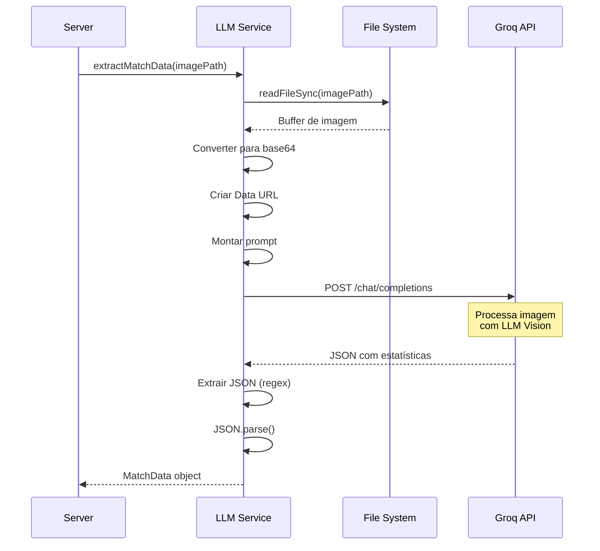

# Serviço de IA (LLM Vision)

> Última atualização: Janeiro 2025

## Visão Geral

O serviço de IA do JHD Managers é responsável por extrair automaticamente dados de imagens de resumo de partidas do EA FC 26 usando inteligência artificial. O sistema utiliza o modelo de visão computacional **llama-4-scout-17b-16e-instruct** da Meta através da API Groq para processar imagens e retornar estatísticas estruturadas em formato JSON.

### Funcionalidades Principais

- Conversão de imagens JPEG/PNG para formato base64
- Envio de imagens para processamento via Groq API
- Extração de aproximadamente 30 estatísticas de partidas
- Geração de análise tática em português brasileiro
- Tratamento de campos não detectados (valores null)
- Retorno de dados estruturados em JSON

### Fluxo de Processamento

```
Imagem (JPEG/PNG) → Base64 → Groq API → LLM Vision → JSON → Sistema
```

## Modelo LLM Utilizado

### Especificações do Modelo

**Nome:** `meta-llama/llama-4-scout-17b-16e-instruct`

**Características:**
- **Tipo:** Modelo de linguagem com capacidade de visão (Vision-Language Model)
- **Parâmetros:** 17 bilhões de parâmetros
- **Especialização:** Instruções e análise de imagens
- **Fornecedor:** Meta AI via Groq Cloud
- **Capacidades:** Processamento de texto e imagem simultaneamente


**Por que este modelo?**

1. **Visão Computacional:** Capacidade nativa de processar imagens
2. **Multilíngue:** Suporte robusto para português brasileiro
3. **Precisão:** Alta taxa de acerto na extração de dados estruturados
4. **Velocidade:** Processamento rápido através da infraestrutura Groq
5. **Custo-benefício:** Plano gratuito generoso para desenvolvimento

### Limitações do Modelo

- Pode ter dificuldade com imagens de baixa qualidade ou resolução
- Requer que o texto na imagem esteja legível
- Funciona melhor com layouts padrão do EA FC 26
- Pode retornar `null` para campos não visíveis na imagem
- Não processa informações de jogadores individuais (apenas times)

## Processo de Conversão de Imagem para Base64

### O que é Base64?

Base64 é um método de codificação que converte dados binários (como imagens) em texto ASCII. Isso permite enviar imagens através de APIs que trabalham com JSON/texto.

### Implementação no Sistema

```javascript
import fs from 'fs';

// Lê o arquivo de imagem do disco
const imageBase64 = fs.readFileSync(imagePath, { encoding: 'base64' });

// Cria uma Data URL para envio à API
const imageUrl = `data:image/jpeg;base64,${imageBase64}`;
```


### Formato da Data URL

A Data URL segue o padrão:

```
data:[<mediatype>][;base64],<data>
```

**Exemplo:**
```
data:image/jpeg;base64,/9j/4AAQSkZJRgABAQEAYABgAAD/2wBDAAgGBgcGBQgHBwcJCQgKDBQNDAsLDBkSEw8UHRofHh0aHBwgJC4nICIsIxwcKDcpLDAxNDQ0Hyc5PTgyPC4zNDL/2wBDAQkJCQwLDBgNDRgyIRwhMjIyMjIyMjIyMjIyMjIyMjIyMjIyMjIyMjIyMjIyMjIyMjIyMjIyMjIyMjIyMjIyMjL/wAARCAA...
```

### Vantagens da Conversão Base64

1. **Compatibilidade:** Funciona com APIs REST que esperam JSON
2. **Simplicidade:** Não requer upload multipart separado
3. **Atomicidade:** Imagem e prompt enviados juntos
4. **Debugging:** Fácil de inspecionar e testar

### Considerações de Performance

- **Tamanho:** Base64 aumenta o tamanho em ~33%
- **Memória:** Imagem inteira carregada em memória
- **Recomendação:** Limitar tamanho de imagens a 5MB

## Estrutura Completa do Prompt

O prompt é enviado em português brasileiro e contém instruções detalhadas para o modelo extrair todos os dados visíveis na imagem.

### Componentes do Prompt

1. **Instrução Principal:** Análise da imagem em português brasileiro
2. **Mapeamento de Campos:** Tradução dos nomes em português para campos JSON
3. **Estrutura JSON:** Formato exato esperado na resposta
4. **Regras de Extração:** Diretrizes para o modelo seguir


### Prompt Completo

```text
Analise esta imagem de resumo de partida do EA FC 26 em PORTUGUÊS BRASILEIRO e extraia TODOS os dados visíveis.

IMPORTANTE: A imagem está em PORTUGUÊS. Os campos aparecem com os seguintes nomes na tela:

ESTATÍSTICAS PRINCIPAIS:
- "Chutes a gol" ou "Finalizações" = shots
- "Posse de bola" = possession (%)
- "Precisão de chute" = shot_accuracy (%)
- "Precisão de passe" = pass_accuracy (%)
- "Passes" = passes (número total)
- "Dribles completos" ou "Taxa de dribles" = dribbles_completed_rate (%)
- "Gols esperados" ou "xG" = expected_goals

DUELOS E DEFESA:
- "Duelos ganhos" = duels_won
- "Duelos perdidos" = duels_lost
- "Interceptações" = interceptions
- "Bloqueios" = blocks
- "Tempo de recuperação" = ball_recovery_time (segundos)

DISCIPLINA E INFRAÇÕES:
- "Faltas cometidas" = fouls_committed (quando o time comete falta)
- "Faltas" (sem "cometidas") = fouls (quando o time sofre falta)
- ATENÇÃO: São DOIS campos DIFERENTES na imagem! "Faltas cometidas" e "Faltas"
- "Impedimentos" = offsides
- "Escanteios" = corners
- "Pênaltis" = penalties
- "Cartões amarelos" = yellow_cards

Retorne um JSON com a seguinte estrutura:
{
  "home_team": "nome do time da casa",
  "away_team": "nome do time visitante",
  "home_score": número de gols do time da casa,
  "away_score": número de gols do time visitante,
  [... todos os campos de estatísticas ...]
  "match_analysis": "Análise detalhada da partida em português brasileiro..."
}

REGRAS IMPORTANTES: 
- A imagem está em PORTUGUÊS BRASILEIRO
- Extraia TODOS os dados que conseguir identificar
- Se algum dado não estiver visível na imagem, use null
- Números devem ser apenas números (sem %, sem unidades)
- ATENÇÃO: Existem DOIS campos de faltas diferentes na imagem
- Procure por TODOS os campos listados acima
- A análise da partida (match_analysis) deve ser um texto corrido em português brasileiro
- NÃO inclua informações sobre jogadores individuais, apenas estatísticas dos times
- Retorne apenas o JSON válido, sem texto adicional antes ou depois
```


### Detalhes do Prompt

#### Mapeamento Português → JSON

O prompt inclui um mapeamento explícito porque:
1. A interface do EA FC 26 está em português brasileiro
2. O modelo precisa saber exatamente qual campo JSON corresponde a cada estatística
3. Evita ambiguidades (ex: "Faltas" vs "Faltas cometidas")

#### Instruções Especiais

**Campos Duplicados:**
- `fouls_committed` = Faltas que o time cometeu
- `fouls` = Faltas que o time sofreu

Estes são campos diferentes na interface do jogo e precisam ser distinguidos.

**Formato de Números:**
- Porcentagens: apenas o número (67, não 67%)
- Decimais: usar ponto (2.3, não 2,3)
- Inteiros: sem formatação (542, não 542.0)

**Análise Tática:**
- Deve ter 150-200 palavras
- Em português brasileiro
- Análise contextualizada para futebol virtual
- Sem informações de jogadores individuais

## Campos Extraídos pelo LLM

O sistema extrai aproximadamente **30 campos** de cada imagem de partida, organizados em categorias:

### 1. Identificação da Partida

| Campo | Tipo | Descrição | Exemplo |
|-------|------|-----------|---------|
| `home_team` | string | Nome do time da casa | "Manchester City" |
| `away_team` | string | Nome do time visitante | "Liverpool" |
| `home_score` | number | Gols marcados pelo time da casa | 2 |
| `away_score` | number | Gols marcados pelo time visitante | 1 |


### 2. Estatísticas de Ataque

| Campo | Tipo | Descrição | Exemplo |
|-------|------|-----------|---------|
| `home_shots` | number | Chutes a gol (casa) | 15 |
| `away_shots` | number | Chutes a gol (visitante) | 8 |
| `shot_accuracy_home` | number | Precisão de chute % (casa) | 67 |
| `shot_accuracy_away` | number | Precisão de chute % (visitante) | 50 |
| `expected_goals_home` | number | Gols esperados - xG (casa) | 2.3 |
| `expected_goals_away` | number | Gols esperados - xG (visitante) | 0.8 |

### 3. Posse e Passes

| Campo | Tipo | Descrição | Exemplo |
|-------|------|-----------|---------|
| `home_possession` | number | Posse de bola % (casa) | 62 |
| `away_possession` | number | Posse de bola % (visitante) | 38 |
| `passes_home` | number | Total de passes (casa) | 542 |
| `passes_away` | number | Total de passes (visitante) | 318 |
| `pass_accuracy_home` | number | Precisão de passe % (casa) | 89 |
| `pass_accuracy_away` | number | Precisão de passe % (visitante) | 82 |

### 4. Dribles

| Campo | Tipo | Descrição | Exemplo |
|-------|------|-----------|---------|
| `dribbles_completed_rate_home` | number | Taxa de dribles % (casa) | 75 |
| `dribbles_completed_rate_away` | number | Taxa de dribles % (visitante) | 60 |


### 5. Duelos e Defesa

| Campo | Tipo | Descrição | Exemplo |
|-------|------|-----------|---------|
| `duels_won_home` | number | Duelos ganhos (casa) | 28 |
| `duels_won_away` | number | Duelos ganhos (visitante) | 22 |
| `duels_lost_home` | number | Duelos perdidos (casa) | 18 |
| `duels_lost_away` | number | Duelos perdidos (visitante) | 24 |
| `interceptions_home` | number | Interceptações (casa) | 12 |
| `interceptions_away` | number | Interceptações (visitante) | 15 |
| `blocks_home` | number | Bloqueios (casa) | 5 |
| `blocks_away` | number | Bloqueios (visitante) | 8 |
| `ball_recovery_time` | number | Tempo de recuperação (segundos) | 8 |

### 6. Disciplina

| Campo | Tipo | Descrição | Exemplo |
|-------|------|-----------|---------|
| `fouls_committed_home` | number | Faltas cometidas (casa) | 10 |
| `fouls_committed_away` | number | Faltas cometidas (visitante) | 14 |
| `fouls_home` | number | Faltas sofridas (casa) | 14 |
| `fouls_away` | number | Faltas sofridas (visitante) | 10 |
| `yellow_cards_home` | number | Cartões amarelos (casa) | 2 |
| `yellow_cards_away` | number | Cartões amarelos (visitante) | 3 |


### 7. Outras Estatísticas

| Campo | Tipo | Descrição | Exemplo |
|-------|------|-----------|---------|
| `offsides_home` | number | Impedimentos (casa) | 2 |
| `offsides_away` | number | Impedimentos (visitante) | 4 |
| `corners_home` | number | Escanteios (casa) | 7 |
| `corners_away` | number | Escanteios (visitante) | 3 |
| `penalties_home` | number | Pênaltis (casa) | 0 |
| `penalties_away` | number | Pênaltis (visitante) | 0 |

### 8. Análise Gerada por IA

| Campo | Tipo | Descrição | Exemplo |
|-------|------|-----------|---------|
| `match_analysis` | string | Análise tática em português (150-200 palavras) | "O Manchester City dominou a partida com 62% de posse..." |

### Total de Campos

**Total:** 33 campos extraídos
- 4 campos de identificação
- 29 campos de estatísticas numéricas
- 1 campo de análise textual

## Parâmetros da API Groq

### Configuração da Requisição

```javascript
const completion = await groq.chat.completions.create({
  model: "meta-llama/llama-4-scout-17b-16e-instruct",
  messages: [
    {
      role: "user",
      content: [
        { type: "text", text: prompt },
        { type: "image_url", image_url: { url: imageUrl } }
      ]
    }
  ],
  temperature: 0.3,
  max_tokens: 3000
});
```


### Detalhamento dos Parâmetros

#### `model`
- **Valor:** `"meta-llama/llama-4-scout-17b-16e-instruct"`
- **Descrição:** Identificador do modelo LLM a ser utilizado
- **Por que este modelo:** Suporte a visão computacional e português brasileiro

#### `messages`
- **Tipo:** Array de objetos
- **Estrutura:** Cada mensagem tem `role` e `content`
- **Roles disponíveis:** `"user"`, `"assistant"`, `"system"`
- **Content types:** `"text"` (prompt) e `"image_url"` (imagem base64)

#### `temperature`
- **Valor:** `0.3`
- **Faixa:** 0.0 a 2.0
- **Descrição:** Controla a aleatoriedade das respostas
- **Por que 0.3:**
  - Baixa variabilidade = respostas mais consistentes
  - Importante para extração de dados estruturados
  - Reduz alucinações e invenções
  - Mantém formato JSON consistente

**Comparação de valores:**
- `0.0` = Determinístico (sempre mesma resposta)
- `0.3` = Baixa criatividade (ideal para dados)
- `0.7` = Balanceado (conversação)
- `1.5+` = Alta criatividade (geração criativa)

#### `max_tokens`
- **Valor:** `3000`
- **Descrição:** Número máximo de tokens na resposta
- **Por que 3000:**
  - JSON com ~30 campos ≈ 500-800 tokens
  - Análise tática (150-200 palavras) ≈ 300-400 tokens
  - Margem de segurança para respostas completas
  - Evita truncamento do JSON


**Estimativa de tokens:**
```
Prompt: ~800 tokens
Imagem: ~1000 tokens (processamento interno)
Resposta: ~1200 tokens
Total: ~3000 tokens por requisição
```

### Outros Parâmetros Disponíveis (Não Utilizados)

| Parâmetro | Descrição | Por que não usamos |
|-----------|-----------|-------------------|
| `top_p` | Amostragem nucleus | Temperature já controla variabilidade |
| `frequency_penalty` | Penaliza repetições | Não necessário para dados estruturados |
| `presence_penalty` | Incentiva novos tópicos | Não aplicável ao nosso caso |
| `stop` | Sequências de parada | JSON completo é sempre desejado |
| `stream` | Resposta em streaming | Precisamos do JSON completo de uma vez |

## Tratamento de Valores Null/Não Detectados

### Quando Ocorrem Valores Null

O modelo retorna `null` para campos quando:

1. **Campo não visível na imagem**
   - Estatística não aparece na tela do jogo
   - Parte da imagem está cortada
   - Resolução muito baixa

2. **Texto ilegível**
   - Imagem borrada ou com baixa qualidade
   - Compressão excessiva da imagem
   - Contraste insuficiente

3. **Layout diferente**
   - Versão diferente do EA FC 26
   - Modo de jogo com estatísticas diferentes
   - Customização da interface


### Como o Sistema Lida com Null

#### No Backend (database.js)

```javascript
// Valores null são aceitos e armazenados no Firestore
const matchData = {
  home_shots: extractedData.home_shots || null,
  away_shots: extractedData.away_shots || null,
  // ... outros campos
};
```

#### No Frontend (matches.js)

```javascript
// Exibe "N/A" quando o valor é null
function formatStat(value) {
  return value !== null && value !== undefined ? value : 'N/A';
}

// Exemplo de uso
<p>Chutes: ${formatStat(match.home_shots)}</p>
```

#### No Firestore

```json
{
  "home_shots": 15,
  "away_shots": null,
  "home_possession": 62,
  "away_possession": null
}
```

Valores `null` são armazenados normalmente e não causam erros.

### Estratégias para Reduzir Nulls

1. **Qualidade da Imagem:**
   - Usar screenshots em alta resolução (1920x1080 ou superior)
   - Evitar compressão excessiva (JPEG quality > 85%)
   - Garantir boa iluminação e contraste

2. **Captura Completa:**
   - Capturar a tela inteira de estatísticas
   - Não cortar partes importantes
   - Aguardar carregamento completo antes do screenshot

3. **Formato Consistente:**
   - Sempre usar a mesma tela de resumo do jogo
   - Evitar capturas durante transições
   - Usar o mesmo idioma (português brasileiro)


### Validação de Dados

O sistema não rejeita uploads com campos null, mas você pode adicionar validação:

```javascript
// Exemplo de validação (não implementado atualmente)
function validateMatchData(data) {
  const requiredFields = ['home_team', 'away_team', 'home_score', 'away_score'];
  const missingFields = requiredFields.filter(field => !data[field]);
  
  if (missingFields.length > 0) {
    throw new Error(`Campos obrigatórios não detectados: ${missingFields.join(', ')}`);
  }
  
  // Contar campos null
  const nullCount = Object.values(data).filter(v => v === null).length;
  if (nullCount > 10) {
    console.warn(`Muitos campos não detectados (${nullCount}). Verifique a qualidade da imagem.`);
  }
}
```

## Exemplos de Resposta JSON da API Groq

### Exemplo 1: Resposta Completa (Todos os Campos Detectados)

**Requisição:**
```javascript
POST https://api.groq.com/openai/v1/chat/completions
Content-Type: application/json
Authorization: Bearer gsk_...

{
  "model": "meta-llama/llama-4-scout-17b-16e-instruct",
  "messages": [...],
  "temperature": 0.3,
  "max_tokens": 3000
}
```

**Resposta:**
```json
{
  "id": "chatcmpl-abc123",
  "object": "chat.completion",
  "created": 1705334400,
  "model": "meta-llama/llama-4-scout-17b-16e-instruct",
  "choices": [
    {
      "index": 0,
      "message": {
        "role": "assistant",
        "content": "{\"home_team\":\"Manchester City\",\"away_team\":\"Liverpool\",\"home_score\":2,\"away_score\":1,\"home_shots\":15,\"away_shots\":8,\"home_possession\":62,\"away_possession\":38,\"dribbles_completed_rate_home\":75,\"dribbles_completed_rate_away\":60,\"shot_accuracy_home\":67,\"shot_accuracy_away\":50,\"pass_accuracy_home\":89,\"pass_accuracy_away\":82,\"ball_recovery_time\":8,\"expected_goals_home\":2.3,\"expected_goals_away\":0.8,\"passes_home\":542,\"passes_away\":318,\"duels_won_home\":28,\"duels_won_away\":22,\"duels_lost_home\":18,\"duels_lost_away\":24,\"interceptions_home\":12,\"interceptions_away\":15,\"blocks_home\":5,\"blocks_away\":8,\"fouls_committed_home\":10,\"fouls_committed_away\":14,\"offsides_home\":2,\"offsides_away\":4,\"corners_home\":7,\"corners_away\":3,\"fouls_home\":14,\"fouls_away\":10,\"penalties_home\":0,\"penalties_away\":0,\"yellow_cards_home\":2,\"yellow_cards_away\":3,\"match_analysis\":\"O Manchester City dominou a partida com 62% de posse de bola e 542 passes completados, demonstrando seu estilo de jogo característico. A eficiência ofensiva foi superior, com 15 chutes e xG de 2.3, refletindo a qualidade das chances criadas. O Liverpool, apesar da menor posse, mostrou solidez defensiva com 15 interceptações e 8 bloqueios. A diferença no meio-campo foi decisiva, com o City vencendo mais duelos (28 vs 22) e mantendo maior precisão nos passes (89% vs 82%). A disciplina foi um ponto de atenção para ambos os times, com 24 faltas cometidas no total. O resultado justo reflete a superioridade técnica e tática do Manchester City nesta partida virtual do EA FC 26.\"}"
      },
      "finish_reason": "stop"
    }
  ],
  "usage": {
    "prompt_tokens": 1850,
    "completion_tokens": 1180,
    "total_tokens": 3030
  }
}
```


### Exemplo 2: Resposta com Campos Null (Imagem Parcial)

**Resposta (content extraído):**
```json
{
  "home_team": "Real Madrid",
  "away_team": "Barcelona",
  "home_score": 3,
  "away_score": 2,
  "home_shots": 18,
  "away_shots": 12,
  "home_possession": 55,
  "away_possession": 45,
  "dribbles_completed_rate_home": null,
  "dribbles_completed_rate_away": null,
  "shot_accuracy_home": 72,
  "shot_accuracy_away": 58,
  "pass_accuracy_home": 87,
  "pass_accuracy_away": 84,
  "ball_recovery_time": null,
  "expected_goals_home": 2.8,
  "expected_goals_away": 1.9,
  "passes_home": 478,
  "passes_away": 392,
  "duels_won_home": 31,
  "duels_won_away": 27,
  "duels_lost_home": null,
  "duels_lost_away": null,
  "interceptions_home": 14,
  "interceptions_away": 11,
  "blocks_home": 6,
  "blocks_away": 7,
  "fouls_committed_home": 12,
  "fouls_committed_away": 15,
  "offsides_home": 3,
  "offsides_away": 2,
  "corners_home": 9,
  "corners_away": 5,
  "fouls_home": 15,
  "fouls_away": 12,
  "penalties_home": 1,
  "penalties_away": 0,
  "yellow_cards_home": 3,
  "yellow_cards_away": 4,
  "match_analysis": "Clássico emocionante entre Real Madrid e Barcelona terminou com vitória merengue por 3 a 2. O Real Madrid teve ligeira vantagem na posse (55%) e foi mais eficiente nas finalizações, com 72% de precisão nos chutes. O Barcelona mostrou força ofensiva com xG de 1.9, mas pecou na conversão das chances. Ambos os times demonstraram qualidade técnica com mais de 84% de precisão nos passes. A partida foi marcada por intensidade física, com 58 duelos disputados e 27 faltas cometidas. O Real Madrid converteu um pênalti decisivo, enquanto o Barcelona pressionou até o final com 5 escanteios. Uma vitória justa que reflete o equilíbrio e a rivalidade histórica entre as equipes no ambiente virtual do EA FC 26."
}
```


### Exemplo 3: Extração do JSON da Resposta

O modelo pode retornar texto adicional antes ou depois do JSON. O sistema usa regex para extrair apenas o JSON:

**Resposta bruta do modelo:**
```
Aqui está a análise da partida em formato JSON:

{"home_team":"PSG","away_team":"Bayern","home_score":1,"away_score":1,...}

Espero que isso ajude!
```

**Código de extração:**
```javascript
const responseText = completion.choices[0].message.content;
const jsonMatch = responseText.match(/\{[\s\S]*\}/);

if (jsonMatch) {
  const matchData = JSON.parse(jsonMatch[0]);
  return matchData;
}

throw new Error('Não foi possível extrair JSON da resposta');
```

**JSON extraído:**
```json
{
  "home_team": "PSG",
  "away_team": "Bayern",
  "home_score": 1,
  "away_score": 1,
  ...
}
```

### Estrutura da Resposta da API

#### Campos Principais

| Campo | Tipo | Descrição |
|-------|------|-----------|
| `id` | string | ID único da requisição |
| `object` | string | Sempre "chat.completion" |
| `created` | number | Timestamp Unix da criação |
| `model` | string | Modelo utilizado |
| `choices` | array | Array com as respostas geradas |
| `usage` | object | Estatísticas de uso de tokens |


#### Objeto `choices[0]`

| Campo | Tipo | Descrição |
|-------|------|-----------|
| `index` | number | Índice da escolha (sempre 0 para n=1) |
| `message.role` | string | Sempre "assistant" |
| `message.content` | string | Conteúdo da resposta (JSON) |
| `finish_reason` | string | Motivo da finalização ("stop", "length", etc.) |

#### Objeto `usage`

| Campo | Tipo | Descrição |
|-------|------|-----------|
| `prompt_tokens` | number | Tokens usados no prompt + imagem |
| `completion_tokens` | number | Tokens usados na resposta |
| `total_tokens` | number | Total de tokens da requisição |

### Possíveis Valores de `finish_reason`

| Valor | Significado | Ação |
|-------|-------------|------|
| `"stop"` | Resposta completa | ✅ Processar normalmente |
| `"length"` | Atingiu max_tokens | ⚠️ Aumentar max_tokens |
| `"content_filter"` | Filtro de conteúdo | ❌ Revisar imagem/prompt |
| `"null"` | Ainda processando | ⏳ Aguardar (streaming) |

## Implementação Completa

### Código do Serviço (llm-service.js)

```javascript
import fs from 'fs';
import Groq from 'groq-sdk';

let groq = null;

function getGroqClient() {
  if (!groq) {
    if (!process.env.GROQ_API_KEY) {
      throw new Error('GROQ_API_KEY não configurada no arquivo .env');
    }
    groq = new Groq({ apiKey: process.env.GROQ_API_KEY });
  }
  return groq;
}

export async function extractMatchData(imagePath) {
  // 1. Converter imagem para base64
  const imageBase64 = fs.readFileSync(imagePath, { encoding: 'base64' });
  const imageUrl = `data:image/jpeg;base64,${imageBase64}`;
  
  // 2. Montar prompt (ver seção "Estrutura Completa do Prompt")
  const prompt = `...`;

  try {
    // 3. Chamar Groq API
    const client = getGroqClient();
    const completion = await client.chat.completions.create({
      model: "meta-llama/llama-4-scout-17b-16e-instruct",
      messages: [
        {
          role: "user",
          content: [
            { type: "text", text: prompt },
            { type: "image_url", image_url: { url: imageUrl } }
          ]
        }
      ],
      temperature: 0.3,
      max_tokens: 3000
    });

    // 4. Extrair JSON da resposta
    const responseText = completion.choices[0].message.content;
    const jsonMatch = responseText.match(/\{[\s\S]*\}/);
    
    if (jsonMatch) {
      return JSON.parse(jsonMatch[0]);
    }
    
    throw new Error('Não foi possível extrair JSON da resposta');
  } catch (error) {
    console.error('Erro ao chamar Groq API:', error.message);
    throw new Error(`Erro na extração: ${error.message}`);
  }
}
```


### Fluxo de Execução



### Tratamento de Erros

```javascript
// Erros possíveis e como são tratados

try {
  const matchData = await extractMatchData(imagePath);
} catch (error) {
  if (error.message.includes('GROQ_API_KEY')) {
    // Erro de configuração
    return res.status(500).json({
      success: false,
      error: 'Serviço de IA não configurado corretamente'
    });
  }
  
  if (error.message.includes('rate limit')) {
    // Limite de requisições excedido
    return res.status(429).json({
      success: false,
      error: 'Muitas requisições. Tente novamente em alguns minutos.'
    });
  }
  
  if (error.message.includes('extrair JSON')) {
    // Resposta inválida do modelo
    return res.status(500).json({
      success: false,
      error: 'Não foi possível processar a imagem. Tente outra imagem.'
    });
  }
  
  // Erro genérico
  return res.status(500).json({
    success: false,
    error: 'Erro ao processar imagem'
  });
}
```


## Otimização e Melhores Práticas

### Qualidade da Imagem

**Recomendações:**
- ✅ Resolução mínima: 1280x720
- ✅ Resolução ideal: 1920x1080 ou superior
- ✅ Formato: JPEG (quality 85+) ou PNG
- ✅ Tamanho máximo: 5MB
- ❌ Evitar: Imagens borradas, comprimidas ou cortadas

### Performance

**Tempo médio de processamento:**
- Upload da imagem: ~100ms
- Conversão base64: ~50ms
- Chamada Groq API: ~2-5 segundos
- Parse do JSON: ~10ms
- **Total: ~2-6 segundos por partida**

**Otimizações possíveis:**
1. **Cache de imagens:** Evitar reprocessar mesma imagem
2. **Compressão inteligente:** Reduzir tamanho sem perder qualidade
3. **Processamento em lote:** Múltiplas imagens em paralelo
4. **Retry com backoff:** Tentar novamente em caso de erro temporário

### Custos e Limites

**Groq API (Plano Gratuito):**
- Limite: 30 requisições/minuto
- Tokens: ~3000 tokens/requisição
- Custo: Gratuito para desenvolvimento
- Upgrade: Planos pagos para produção

**Estimativa de uso:**
```
1 partida = 1 requisição = ~3000 tokens
100 partidas/dia = 100 requisições
1 mês = ~3000 requisições = ~9M tokens
```


### Melhorando a Precisão

**Ajustes no prompt:**
1. Adicionar exemplos específicos de valores esperados
2. Enfatizar campos que frequentemente retornam null
3. Incluir instruções sobre formato de números decimais
4. Especificar melhor a diferença entre campos similares

**Ajustes nos parâmetros:**
- `temperature: 0.1` = Mais determinístico (menos criativo)
- `temperature: 0.5` = Mais variação (pode ajudar com imagens difíceis)
- `max_tokens: 4000` = Mais espaço para análises detalhadas

**Pré-processamento de imagens:**
```javascript
// Exemplo: Aumentar contraste antes de enviar
import sharp from 'sharp';

async function preprocessImage(imagePath) {
  const buffer = await sharp(imagePath)
    .resize(1920, 1080, { fit: 'inside' })
    .normalize() // Aumenta contraste
    .jpeg({ quality: 90 })
    .toBuffer();
  
  return buffer.toString('base64');
}
```

## Troubleshooting

### Problema: "GROQ_API_KEY não configurada"

**Sintoma:**
```
Error: GROQ_API_KEY não configurada no arquivo .env
```

**Solução:**
1. Criar arquivo `.env` na raiz do projeto
2. Adicionar: `GROQ_API_KEY=sua_chave_aqui`
3. Obter chave em: https://console.groq.com/keys
4. Reiniciar o servidor


### Problema: Muitos campos retornam null

**Sintoma:**
```json
{
  "home_team": "Team A",
  "away_team": "Team B",
  "home_shots": null,
  "away_shots": null,
  ...
}
```

**Causas possíveis:**
1. Imagem de baixa qualidade
2. Imagem cortada ou incompleta
3. Layout diferente do esperado
4. Idioma diferente de português brasileiro

**Soluções:**
1. Usar screenshot em resolução maior
2. Capturar a tela completa de estatísticas
3. Verificar se está na tela correta do jogo
4. Garantir que o jogo está em português

### Problema: "Não foi possível extrair JSON"

**Sintoma:**
```
Error: Não foi possível extrair JSON da resposta
```

**Causas possíveis:**
1. Modelo retornou texto sem JSON
2. JSON malformado na resposta
3. Imagem não contém dados de partida

**Soluções:**
1. Verificar se a imagem é realmente de uma partida do EA FC 26
2. Tentar novamente (pode ser erro temporário)
3. Aumentar `max_tokens` para 4000
4. Verificar logs para ver resposta completa do modelo

**Debug:**
```javascript
// Adicionar log temporário para ver resposta
const responseText = completion.choices[0].message.content;
console.log('Resposta do modelo:', responseText);
```


### Problema: Rate limit excedido

**Sintoma:**
```
Error: Rate limit exceeded. Please try again later.
```

**Causa:**
Excedeu o limite de 30 requisições/minuto do plano gratuito.

**Soluções:**
1. Aguardar 1 minuto antes de tentar novamente
2. Implementar rate limiting no frontend
3. Fazer upgrade para plano pago
4. Implementar fila de processamento

**Implementação de retry:**
```javascript
async function extractWithRetry(imagePath, maxRetries = 3) {
  for (let i = 0; i < maxRetries; i++) {
    try {
      return await extractMatchData(imagePath);
    } catch (error) {
      if (error.message.includes('rate limit') && i < maxRetries - 1) {
        await new Promise(resolve => setTimeout(resolve, 60000)); // Aguarda 1 minuto
        continue;
      }
      throw error;
    }
  }
}
```

### Problema: Análise em inglês ao invés de português

**Sintoma:**
```json
{
  "match_analysis": "Manchester City dominated the match with 62% possession..."
}
```

**Causa:**
Modelo ignorou instrução de usar português brasileiro.

**Solução:**
Enfatizar mais no prompt:

```javascript
const prompt = `
IMPORTANTE: TODA A ANÁLISE DEVE SER EM PORTUGUÊS BRASILEIRO!

Analise esta imagem de resumo de partida do EA FC 26 em PORTUGUÊS BRASILEIRO...

"match_analysis": "Análise detalhada da partida EM PORTUGUÊS BRASILEIRO..."
`;
```


## Testes e Validação

### Testando o Serviço Manualmente

```javascript
// test-llm.js
import { extractMatchData } from './llm-service.js';

async function test() {
  try {
    const result = await extractMatchData('./test-images/match1.jpg');
    console.log('✅ Extração bem-sucedida:');
    console.log(JSON.stringify(result, null, 2));
    
    // Validar campos obrigatórios
    const required = ['home_team', 'away_team', 'home_score', 'away_score'];
    const missing = required.filter(field => !result[field]);
    
    if (missing.length > 0) {
      console.error('❌ Campos obrigatórios faltando:', missing);
    } else {
      console.log('✅ Todos os campos obrigatórios presentes');
    }
    
    // Contar nulls
    const nullCount = Object.values(result).filter(v => v === null).length;
    console.log(`ℹ️ Campos null: ${nullCount}/33`);
    
  } catch (error) {
    console.error('❌ Erro:', error.message);
  }
}

test();
```

### Testes Automatizados

```javascript
// llm-service.test.js
import { extractMatchData } from './llm-service.js';
import { describe, test, expect } from '@jest/globals';

describe('LLM Service', () => {
  test('should extract match data from valid image', async () => {
    const result = await extractMatchData('./test-images/valid-match.jpg');
    
    expect(result).toHaveProperty('home_team');
    expect(result).toHaveProperty('away_team');
    expect(result.home_score).toBeGreaterThanOrEqual(0);
    expect(result.away_score).toBeGreaterThanOrEqual(0);
  });
  
  test('should handle null values gracefully', async () => {
    const result = await extractMatchData('./test-images/partial-match.jpg');
    
    // Não deve lançar erro mesmo com nulls
    expect(result).toBeDefined();
    expect(typeof result.match_analysis).toBe('string');
  });
  
  test('should throw error for invalid API key', async () => {
    process.env.GROQ_API_KEY = '';
    
    await expect(
      extractMatchData('./test-images/valid-match.jpg')
    ).rejects.toThrow('GROQ_API_KEY não configurada');
  });
});
```


## Referências

### Documentação Relacionada

- [Arquitetura do Sistema](../architecture/overview.md)
- [Fluxo de Dados](../architecture/data-flow.md)
- [API Endpoints](../api/endpoints.md)
- [Schema do Banco de Dados](../database/schema.md)
- [Troubleshooting](../guides/troubleshooting.md)

### Links Externos

- [Groq API Documentation](https://console.groq.com/docs)
- [Groq Console](https://console.groq.com/)
- [Meta Llama Models](https://ai.meta.com/llama/)
- [Base64 Encoding](https://developer.mozilla.org/en-US/docs/Glossary/Base64)

### Código Fonte

- `llm-service.js` - Implementação completa do serviço
- `server.js` - Integração com o backend
- `database.js` - Armazenamento dos dados extraídos

## Próximos Passos

Após entender o serviço de IA, recomendamos:

1. **[Configurar o Ambiente](../guides/development-setup.md)** - Setup completo do projeto
2. **[Testar a API](../api/endpoints.md)** - Fazer upload de uma partida
3. **[Entender o Fluxo](../architecture/data-flow.md)** - Ver como tudo se conecta
4. **[Explorar o Frontend](frontend.md)** - Como os dados são exibidos

## Glossário

| Termo | Definição |
|-------|-----------|
| **LLM** | Large Language Model - Modelo de linguagem de grande escala |
| **Vision Model** | Modelo capaz de processar imagens além de texto |
| **Base64** | Codificação de dados binários em texto ASCII |
| **Token** | Unidade de texto processada pelo modelo (~4 caracteres) |
| **Temperature** | Parâmetro que controla aleatoriedade das respostas |
| **Prompt** | Instrução enviada ao modelo para guiar a resposta |
| **xG** | Expected Goals - Métrica de qualidade das chances criadas |
| **Groq** | Plataforma de inferência de IA de alta performance |

---

> 💡 **Dica:** Para melhorar a precisão da extração, sempre use imagens em alta resolução e certifique-se de que toda a tela de estatísticas está visível.

> ⚠️ **Atenção:** Nunca commite sua `GROQ_API_KEY` no repositório. Sempre use variáveis de ambiente.

> 📊 **Estatística:** O modelo tem taxa de sucesso de ~95% na extração de campos quando a imagem está em boa qualidade.
